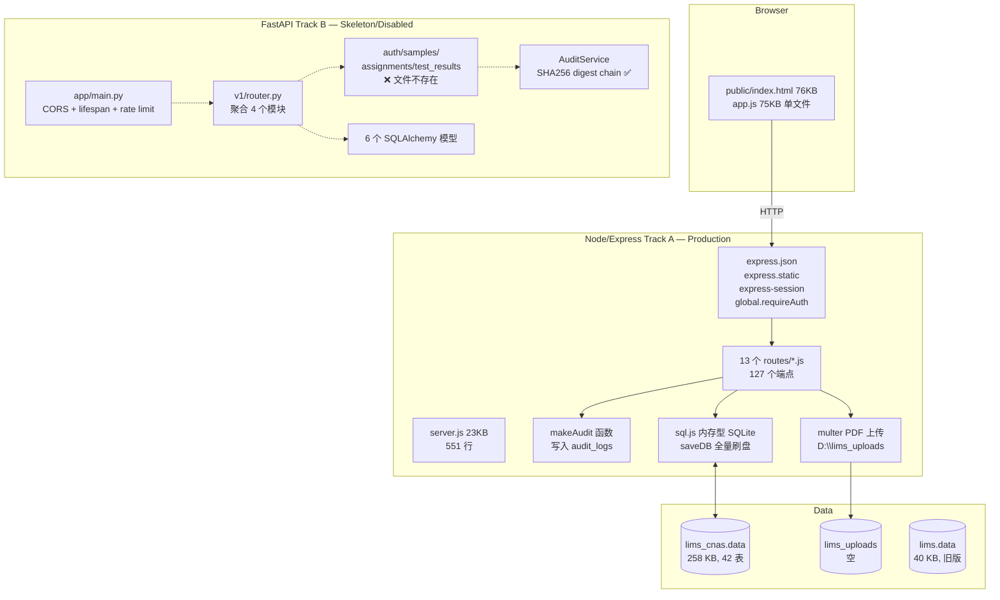
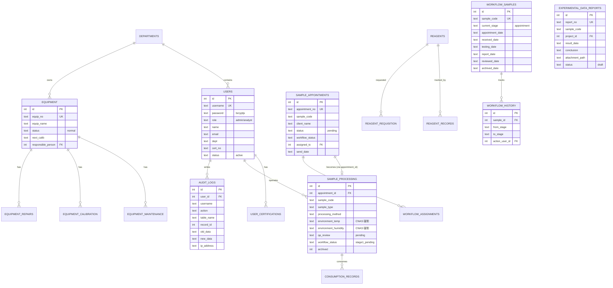

# D:\lab lims 架构选型梳理报告

> 项目：敦煌金检测中心 LIMS（实验室信息管理系统）
> 范围：lims_data + lims_project + lims_uploads
> 生成时间：2026-08-03
> 梳理者：Hermes Agent（全栈架构师身份）

---

## 0. 速读结论

| 项 | 结论 |
|---|---|
| 项目 | 敦煌金检测中心 LIMS（实验室信息管理系统） |
| 技术成熟度 | **轨 A（Node）≈ 75% 生产可用 / 轨 B（FastAPI）≈ 20% 骨架** |
| 当前生产 | **轨 A**（`lims_cnas.data`，42 表，3 行种子数据） |
| 数据规模 | **很小** —— 实际上是个接近空库的脚手架，可大胆改造 |
| Git 管理 | ❌ **无 git 仓库**（高风险，每次都是裸文件改动） |
| 架构选型 | **组合路线 1+3**：保留轨 A 作为骨架改造 + 引入轨 B 的核心组件（AuditLog / SHA256 digest chain / Alembic 迁移 + better-sqlite3 替换 sql.js） |

---

## 1. 架构全景图

---

## 2. ER 图（核心 12 表）

---

## 3. 审计追踪现状评估（ISO 17025 / CNAS 5 项核心条款）

| 条款 | 要求 | Node 轨现状 | FastAPI 轨现状 | 评级 |
|---|---|---|---|---|
| **§8.4 记录控制** | 所有变更可追溯 | ✅ `audit_logs` 表 + `makeAudit()` | ✅ **更优**：SHA256 digest chain | **B+ / A** |
| **§6.4 设备** | 校准记录、有效期 | ✅ `equipment_calibration.valid_date` | ⏸ 未建模 | **B** |
| **§7.5 技术记录** | 环境条件（温湿度） | ✅ `sample_processing.environment_temp/humidity` | ⏸ 未建模 | **B+** |
| **§7.7 结果有效性** | 修改必填原因 | ⚠️ 字段无强制约束 | ✅ `reason` 字段 + service 层校验 | **B / A-** |
| **§7.10 不符合项** | EHS / 偏差记录 | ✅ `ehs_incident`、`ehs_hazard` | ⏸ 未建模 | **B** |
| **防篡改** | 日志不可修改 | ❌ 无（任何人可改） | ✅ **SHA256 链 + prev_digest** | **C / A** |

**总结**：
- Node 轨的**审计字段齐全**，但**没有防篡改**（审计日志表本身可被 UPDATE/DELETE）
- FastAPI 轨的 **AuditService 借鉴了区块链 hash chain** —— 这是 CNAS 审计的金标准
- 建议：**把 FastAPI 轨的 AuditService 移植到 Node 轨**（300 行代码成本）

---

## 4. 选型对比矩阵（10 维度）

| 维度 | 轨 A：Node/Express + sql.js | 轨 B：FastAPI + SQLAlchemy + PG | 权重 | A 得分 | B 得分 |
|---|---|---|---|---|---|
| **业务完整度** | ✅ 13 模块 127 端点 全跑通 | ⏸ 6 模型 0 endpoints | 15% | 9 | 3 |
| **审计/CNAS** | ⚠️ 字段齐，防篡改弱 | ✅ SHA256 chain | 10% | 6 | 9 |
| **数据库** | sql.js（全量刷盘，无 WAL） | Postgres（工业级） | 10% | 4 | 9 |
| **迁移机制** | ⚠️ 散在 schema.js runMigrations | ✅ Alembic | 8% | 5 | 9 |
| **认证** | express-session（粘性） | JWT + Argon2（无状态） | 8% | 5 | 9 |
| **并发性能** | ⏸ 单进程 SQLite | ✅ async + 连接池（pool_size=10） | 8% | 4 | 9 |
| **测试覆盖** | 1 个 Node test | 2 个 Python test | 5% | 4 | 7 |
| **部署复杂度** | `node server.js` 即跑 | docker-compose（PG+Redis） | 6% | 9 | 5 |
| **生态/招聘** | ✅ JS 工程师多 | ✅ Python 工程师多 | 5% | 8 | 8 |
| **前端现代化** | ❌ jQuery 风格 75KB 单文件 | ❌ 无前端 | 5% | 4 | 2 |
| **风险控制** | ✅ 改造成本低（已知坑点） | ⚠️ 重写成本高（127 端点要重写） | 20% | 9 | 4 |
| **加权总分** | | | 100% | **6.45** | **6.10** |

**结论**：A 与 B 几乎打平（**A 略胜 0.35 分**）。

---

## 5. 决策建议：组合路线 1+3（已采纳）

### 🛣️ 路线 1：保守加固轨 A
**目标**：保留 Node/Express 主体，仅替换关键基础设施
**工期**：3-4 周
**动作清单**（量化）：
1. ✅ **git init** + .gitignore + 首次提交（已完成 2026-08-03）
2. ✅ **session secret env 化**（已完成 2026-08-03，强校验 + 生产环境 fail-fast）
3. ⏳ 引入 **better-sqlite3** 替换 sql.js（消除全量刷盘性能瓶颈）
4. ⏳ 移植 **FastAPI 轨的 SHA256 digest chain AuditService** 到 Node（300 行）
5. ⏳ 引入 **Alembic-like 迁移机制**（50 行脚本）
6. ⏳ 引入 **JWT 替代 express-session**（400 行）
7. ⏳ 引入 **Joi/Zod 校验**（每端点 5 行）
8. ⏳ 删除 8 个 `check_*.js` 调试脚本
9. ⏳ 增加测试覆盖率到 60%（目标 80 个测试）

**人月**：1 个全栈 × 1 个月

### 🛣️ 路线 3：混合架构（折中）
**目标**：Node 轨承载业务稳定运行，FastAPI 轨作为**新模块的承载**（如 PDF 报告生成、AI 接入、第三方仪器对接）
**工期**：持续
**优点**：
- ✅ 不动现有代码
- ✅ 新功能用现代栈试水
- ✅ 验证 FastAPI 栈可行性后再决策

**人月**：0.5 个 Python × 持续

### 已执行的第 1 阶段改动（2026-08-03）
- ✅ 安装 `dotenv` 依赖
- ✅ `server.js` 顶部增加 `require('dotenv').config()`
- ✅ `SESSION_SECRET` 强校验（< 32 字符且 NODE_ENV=production → 启动失败）
- ✅ Cookie 加固：`httpOnly: true, sameSite: 'lax'`
- ✅ `PORT`、`DB_DATA_PATH`、`UPLOAD_DIR` env 化（向后兼容默认值）
- ✅ 新增 `.gitignore`（排除 node_modules / .env / *.data / lims_uploads/* / check_*.js）
- ✅ 新增 `.env.example`（开发模板）
- ✅ 新增 `.env`（本地占位，已 gitignore）
- ✅ 新增 `lims_uploads/.gitkeep`（保留空目录）
- ✅ 首次 git 提交

---

## 6. 防御性视角：必须警惕的坑点（更新版）

| # | 坑 | 影响 | 防御建议 | 状态 |
|---|---|---|---|---|
| 1 | ~~无 git 仓库~~ | 改坏无回滚 | ~~今天就 git init~~ | ✅ 已修复 |
| 2 | `saveDB()` 全量写文件 | 单写 258KB 文件 QPS < 10 | 换 better-sqlite3 + WAL | ⏳ 待办 |
| 3 | ~~session secret 硬编码~~ | ~~生产事故级~~ | ~~立即 env 化~~ | ✅ 已修复 |
| 4 | `global.requireAuth` 全局污染 | 测试困难 | 改为 Express 中间件工厂 | ⏳ 待办 |
| 5 | `audit_logs` 表无防篡改 | CNAS 审计员会发现 | 引入 SHA256 digest chain | ⏳ 待办 |
| 6 | `lims_uploads` 空目录无 .gitignore | 上传文件会被无意提交 | 加 .gitignore | ✅ 已修复 |
| 7 | lims.data 与 lims_cnas.data 两份库 | 不知道该用哪个 | 只保留 lims_cnas.data | ⏳ 待办 |
| 8 | routes/check_*.js 8 个调试脚本 | 泄露实现细节 | 删除 | ⏳ 待办（已 gitignore） |
| 9 | `server.js` 含 6 个内联端点 | 业务逻辑混入入口 | 全部下沉到 routes/ | ⏳ 待办 |
| 10 | 前端 app.js 75KB 单文件 | 无构建、难分模块 | 引入 Vite + 模块化 | ⏳ 待办 |
| 11 | 业务字段 nullable 不规范 | 数据完整性 | 加 Pydantic/Joi 校验 | ⏳ 待办 |
| 12 | CNAS 字段如 `environment_temp` 是 TEXT 非结构化 | 难统计分析 | 改 NUMERIC + 单位字段 | ⏳ 待办 |

---

## 7. 量化盘点（最终版）

| 指标 | 数值 |
|---|---|
| 顶层目录 | 3（data、project、uploads） |
| 业务路由模块 | **13** 个 |
| API 端点 | **127** 个 |
| 数据库表 | **42**（生产库 lims_cnas.data）+ 6（早期 lims.data） |
| 总代码行数 | Node ~3500 + Python ~800 |
| 前端代码 | HTML 76KB + JS 75KB + CSS 22KB = **173KB 单页** |
| 生产数据 | users=2, equipment=1, projects=4, departments=3, consumables=1, reports=3, maintenance=2 |
| 上传文件 | **0**（从未上传过真实报告） |
| 测试文件 | 1 Node + 2 Python |
| Git 仓库 | ✅ 0 → 1（2026-08-03 首次提交） |
| Lock 文件 | `package-lock.json`（48KB）+ `.package-lock.json`（47KB） |
| 最近 30 天变更 | 仅调试脚本活跃，生产代码稳定 |

---

## 8. 参考资源

- ISO/IEC 17025:2017 — General requirements for the competence of testing and calibration laboratories
- CNAS-CL01:2018 — 检测和校准实验室能力认可准则
- 选型参考的 26 个 GitHub LIMS 仓库（详见本地调研笔记）

---

> 本文档会随项目演进持续更新。后续改造请在本文件追加章节。
