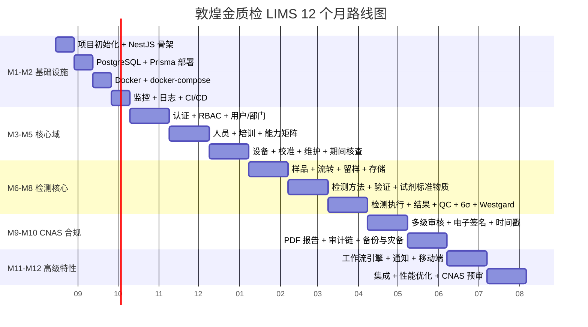

# 00 - 项目计划（PROJECT PLAN）

> **项目**: 敦煌金质检 LIMS（专家级）
> **版本**: v1.0.0
> **日期**: 2026-08-03
> **所有者**: 实验室管理层 + IT 部

---

## 1. 项目愿景

**打造 CNAS 认可级别的专家级 LIMS 系统**，全面支撑敦煌金质检中心的检测业务、质量控制、合规管理、数据分析。

### 1.1 业务价值

- **合规认证**：通过 CNAS 实验室认可 + ISO 17025 体系
- **效率提升**：检测流程自动化 50%+，报告生成时间从 2 天 → 2 小时
- **数据完整性**：ALCOA+ 全原则满足
- **质量控制**：6σ + Westgard 实时监控
- **审计追溯**：所有操作可追溯 5+ 年
- **多端访问**：PC + 移动 + 离线

### 1.2 核心承诺

```
LIMS 系统的"5 个零"
├── 零数据丢失（WAL + 异地备份）
├── 零数据篡改（SHA256 链 + append-only）
├── 零未授权访问（RBAC + ABAC + 多因素）
├── 零审计缺陷（完整 ALCOA+ 记录）
└── 零系统停机（SLA 99.99%）
```

## 2. 业务目标

### 2.1 关键 KPI

| KPI | 当前 | 目标 (M12) | 改进 |
|---|---|---|---|
| 样品日处理量 | 50 件 | 300 件 | 6x |
| 报告生成时间 | 2 天 | 2 小时 | 24x |
| 人员能力匹配 | 70% | 100% | 1.4x |
| 设备利用率 | 50% | 80% | 1.6x |
| 库存预警 | 手动 | 实时 | ∞ |
| 客户满意度 | 80% | 95% | 1.2x |

### 2.2 范围（In Scope）

| 模块 | 包含 |
|---|---|
| 样品管理 | 接收 / 流转 / 留样 / 处置 |
| 检测执行 | 方法 / 设备 / 结果录入 |
| 报告生成 | PDF / 多级审核 / 电子签名 |
| 设备管理 | 全生命周期 / 校准 / 维护 |
| 试剂耗材 | 库存 / 预警 / 有效期 |
| 人员管理 | 培训 / 能力 / 监督 |
| 质量控制 | 空白 / 平行 / 加标 / QC样 |
| 隐患管理 | 排查 / 整改 / 应急 |
| 数据分析 | 趋势 / 统计 / 报表 |
| 系统管理 | 用户 / 角色 / 审计 |

### 2.3 范围（Out of Scope）

- ❌ 财务结算（用 ERP 系统）
- ❌ 客户门户（用独立 CRM）
- ❌ 仪器厂商对接（按需定制）

## 3. 用户角色

| 角色 | 人数 | 权限 |
|---|---|---|
| **实验室主任** | 1 | 全部 |
| **质量负责人** | 1 | 审核 + 报告 + 体系 |
| **设备管理员** | 1 | 设备 + 校准 + 维护 |
| **试剂管理员** | 1 | 试剂 + 耗材 + 库存 |
| **高级检测员** | 3-5 | 检测 + 报告起草 |
| **普通检测员** | 5-10 | 检测 + 录入 |
| **实习生** | 1-3 | 录入（受监督） |
| **外部审核员** | 临时 | 只读 + 审计日志 |

## 4. 关键风险

| 风险 | 概率 | 影响 | 缓解 |
|---|---|---|---|
| CA 证书集成复杂 | 中 | 高 | 提前 POC + 选成熟服务 |
| 数据迁移丢失 | 低 | 严重 | 双重备份 + 小批量分阶段 |
| 性能问题 | 中 | 中 | 预先压测 + 准备回滚 |
| 团队学习曲线 | 中 | 中 | 培训 + 文档 + Code Review |
| 第三方依赖不可用 | 低 | 严重 | 备选供应商 |
| CNAS 审核不通过 | 中 | 严重 | 提前预审 + 外部顾问 |

## 5. 12 个月路线图（总览）



## 6. 团队需求

| 角色 | 人数 | 职责 |
|---|---|---|
| 项目经理 | 1 | 进度 / 协调 / 风险 |
| 架构师 | 1 | 架构 / 规范 / Review |
| 后端工程师 | 2 | NestJS / Prisma / 测试 |
| 前端工程师 | 2 | React / UI / 测试 |
| DevOps | 1 | Docker / K8s / CI/CD |
| 测试工程师 | 1 | 自动化 / 性能 / 验收 |
| CNAS 顾问 | 0.5 | 外部 / 合规审核 |
| **合计** | **8.5** | - |

## 7. 成本估算

| 项 | 金额（万元） | 备注 |
|---|---|---|
| 人力（12 月） | 240 | 8.5 人 × 12 月 |
| 基础设施（云） | 30 | 阿里云 / 华为云 |
| 软件授权 | 10 | CA 证书 / 商业数据库 |
| 培训 + 顾问 | 20 | CNAS 顾问 / 培训 |
| 应急储备 | 20 | 10% 缓冲 |
| **合计** | **320** | - |

## 8. 验收标准

### 8.1 功能验收

- [ ] 13 个核心模块全部上线
- [ ] 200 个真实业务场景测试通过
- [ ] 1000 个并发用户无错误
- [ ] 100 万样品记录流畅查询

### 8.2 合规验收

- [ ] CNAS 现场审核通过
- [ ] ISO 17025 体系认证
- [ ] ALCOA+ 9 原则全满足
- [ ] 审计链 100% 完整

### 8.3 性能验收

- [ ] 页面响应 < 200ms
- [ ] API 响应 P95 < 500ms
- [ ] 系统 SLA 99.99%（年度 < 53 分钟停机）
- [ ] 备份恢复 < 4 小时

## 9. 治理

### 9.1 决策机制

- **架构决策**：架构师 + 项目经理
- **功能优先级**：实验室主任
- **合规问题**：质量负责人 + CNAS 顾问

### 9.2 沟通机制

- **每日站会**：15 分钟
- **每周评审**：1 小时
- **每月总结**：2 hours

### 9.3 风险管理

- 每周更新风险登记册
- 每月风险评估
- 季度风险复盘

## 10. 附录

- [架构设计](01-ARCHITECTURE.md)
- [数据库设计](02-DATABASE.md)
- [API 规范](03-API.md)
- [CNAS 合规](04-CNAS-COMPLIANCE.md)
- [部署架构](05-DEPLOYMENT.md)
- [实施路线图](06-ROADMAP.md)
