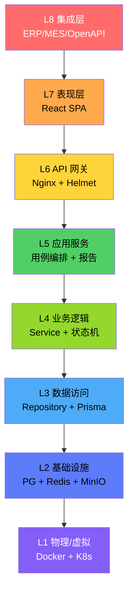
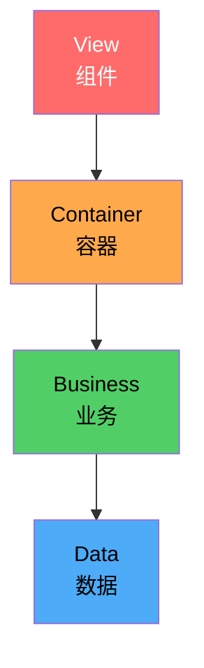
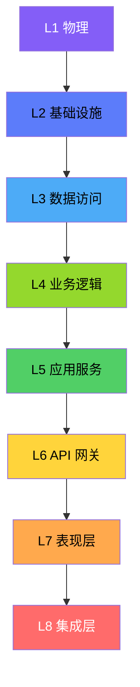
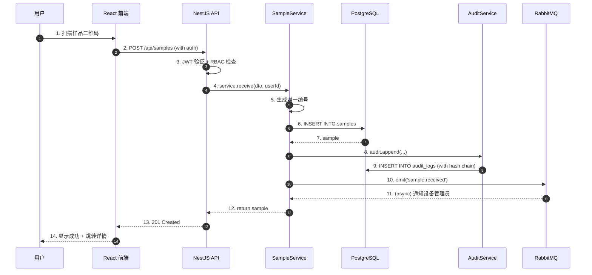
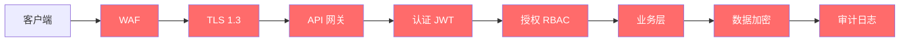

# 01 - 架构设计(ARCHITECTURE)

> **项目**: 敦煌金质检 LIMS(专家级)
> **架构**: 8 层垂直架构 + 11 横切关注点
> **业务**: 贵金属(黄金)检测 —— 火试金法 + ICP(详见 [ADR-0011](./adr/0011-precious-metal-business.md))
> **版本**: v2.0.0
> **日期**: 2026-08-04
> **维护者**: 天枢(架构师)

> ⚠️ **本版本(v2.0)校准**:与 [docs/migration/EXECUTION-PLAN.md](./migration/EXECUTION-PLAN.md) 和 [ADR-0001 ~ ADR-0011](./adr/README.md) 保持一致。所有"为什么"决策已下沉到 ADR。

---

## 0. 架构决策索引(ADR)

| ADR | 决策 | 落地位置 |
|---|---|---|
| [ADR-0001](./adr/0001-monorepo-turborepo.md) | Monorepo + pnpm + Turborepo | `apps/`、`packages/`、`pnpm-workspace.yaml`、`turbo.json` |
| [ADR-0002](./adr/0002-nestjs-prisma-pg.md) | NestJS 10 + Prisma 5 + PG 16 + TimescaleDB | `apps/backend/`、`apps/backend/prisma/` |
| [ADR-0003](./adr/0003-audit-chain-pg-trigger.md) | 审计链 SHA256 = PG 触发器 | `apps/backend/prisma/triggers/audit_chain.sql` |
| [ADR-0004](./adr/0004-ca-third-party.md) | 电子签名 = 第三方 CA | `apps/backend/src/common/signature/` |
| [ADR-0005](./adr/0005-xstate-redundant-db.md) | XState + DB 字段冗余 | `apps/backend/src/modules/*/state-machine.ts` |
| [ADR-0006](./adr/0006-pdf-puppeteer-minio.md) | Puppeteer + MinIO + 时间戳 | `apps/backend/src/modules/report/pdf/` |
| [ADR-0007](./adr/0007-mvp-slice-not-12months.md) | MVP 切片优先(13 周) | [EXECUTION-PLAN.md](./migration/EXECUTION-PLAN.md) |
| [ADR-0008](./adr/0008-local-k8s-kind-k3d.md) | kind/k3d 本地 K8s | `infrastructure/k8s/` |
| [ADR-0009](./adr/0009-jwt-refresh-totp-self-hosted.md) | JWT + Refresh + TOTP 自建 | `apps/backend/src/common/auth/` |
| [ADR-0010](./adr/0010-pwa-indexeddb-lww.md) | PWA 离线 + IndexedDB + LWW | `apps/frontend/src/service-worker/` |
| [ADR-0011](./adr/0011-precious-metal-business.md) | 贵金属检测业务约束 | 所有 schema |

**ADR 是"为什么",本架构文档是"是什么 + 怎么落"**。CNAS 审核员会问"为什么",ADR 给答案。

---

## 1. 设计原则

### 1.1 12 条原则

1. **合规优先**：CNAS / ISO 17025 优先于性能
2. **数据完整性**：ALCOA+ 是不可妥协的底线
3. **分层清晰**：每层只做一件事
4. **关注点分离**：横切关注点用 AOP 方式处理
5. **可观测性**：每个请求可追踪
6. **可测试性**：单元测试覆盖率 > 70%
7. **可维护性**：新人 1 周上手
8. **可扩展性**：水平扩展优先
9. **可移植性**：避免云厂商锁定
10. **安全性**：纵深防御
11. **文档驱动**：代码即文档
12. **演进式**：渐进式重构，不大爆炸

### 1.2 质量属性

| 属性 | 目标 |
|---|---|
| 性能 | API P95 < 500ms |
| 可用性 | 99.99% |
| 扩展性 | 1000+ 并发 |
| 安全性 | CNAS 合规 |
| 可维护性 | MTBF > 720h |
| 可观测性 | 全链路追踪 |

## 2. 整体架构（8 层）



### 2.1 每层职责

| 层 | 职责 | 技术 |
|---|---|---|
| L1 物理/虚拟 | 服务器 + 网络 + 存储 | K8s, Docker, 物理机 |
| L2 基础设施 | 数据库 + 缓存 + 文件 | PostgreSQL, Redis, MinIO |
| L3 数据访问 | Repository + ORM + 迁移 | Prisma, TypeORM |
| L4 业务逻辑 | Service + 状态机 + 规则 | NestJS, XState |
| L5 应用服务 | 用例 + 工作流 + 报告 | NestJS, BullMQ, Puppeteer |
| L6 API 网关 | 路由 + 认证 + 限流 | Express, Helmet, JWT |
| L7 表现层 | SPA + 状态 + 图表 | React, Ant Design, ECharts |
| L8 集成层 | ERP 对接 + OpenAPI + SSO | REST, OIDC |

## 3. 前端架构（4 层）



### 3.1 View 层（视图）

- **组件**：纯函数组件 + Hooks
- **状态**：props + 局部 state
- **错误**：Error Boundary
- **加载**：Suspense

### 3.2 Container 层（容器）

- **数据获取**：TanStack Query
- **全局状态**：Zustand
- **副作用**：useEffect
- **URL 状态**：React Router

### 3.3 Business 层（业务）

- **自定义 Hooks**：useSample, useEquipment
- **校验**：Zod schemas
- **状态机**：XState (前端展示用)
- **规则**：json-rules

### 3.4 Data 层（数据访问）

- **API Client**：Axios + 拦截器
- **缓存**：TanStack Query (5 分钟 TTL)
- **错误处理**：统一格式
- **重试**：指数退避
- **离线队列**：IndexedDB

## 4. 后端架构（8 层）



### 4.1 NestJS 模块结构

```
src/
├── main.ts                          # 入口
├── app.module.ts                    # 根模块
│
├── modules/                         # 业务模块
│   ├── auth/                        # 认证
│   │   ├── auth.module.ts
│   │   ├── auth.controller.ts       # API
│   │   ├── auth.service.ts          # 业务
│   │   ├── auth.repository.ts       # 数据
│   │   ├── dto/                     # 数据传输
│   │   ├── guards/                  # 守卫
│   │   └── strategies/              # 认证策略
│   │
│   ├── sample/                      # 样品
│   │   ├── sample.module.ts
│   │   ├── sample.controller.ts
│   │   ├── sample.service.ts
│   │   ├── sample.repository.ts
│   │   ├── sample.state-machine.ts  # 状态机
│   │   └── dto/
│   │
│   ├── test/                        # 检测
│   ├── equipment/                   # 设备
│   ├── reagent/                     # 试剂
│   ├── ehs/                         # 隐患
│   ├── qc/                          # 质控
│   ├── audit/                       # 审计
│   ├── report/                      # 报告
│   └── workflow/                    # 工作流
│
├── common/                          # 公共
│   ├── guards/                      # JWT, RBAC, RateLimit
│   ├── interceptors/                # 审计, 日志
│   ├── filters/                     # 异常
│   ├── pipes/                       # 校验
│   ├── decorators/                 # 装饰器
│   ├── exceptions/                  # 自定义异常
│   ├── dto/                         # 通用 DTO
│   └── utils/                       # 工具
│
├── infrastructure/                  # 基础设施层
│   ├── database/                    # Prisma
│   │   ├── prisma.module.ts
│   │   └── prisma.service.ts
│   ├── cache/                       # Redis
│   ├── storage/                     # MinIO
│   ├── queue/                       # RabbitMQ
│   ├── search/                      # Meilisearch
│   └── observability/               # 监控
│
└── config/                          # 配置
    ├── database.config.ts
    ├── auth.config.ts
    └── app.config.ts
```

### 4.2 Repository 模式示例

```typescript
// sample.repository.ts
@Injectable()
export class SampleRepository {
  constructor(private prisma: PrismaService) {}

  async findById(id: string): Promise<Sample | null> {
    return this.prisma.sample.findUnique({
      where: { id },
      include: { 
        project: true,
        storage: true,
        tests: { include: { results: true } }
      }
    });
  }

  async findMany(filter: SampleFilter): Promise<Sample[]> {
    return this.prisma.sample.findMany({
      where: filter,
      orderBy: { receivedAt: 'desc' },
      take: filter.limit || 50
    });
  }

  async create(data: CreateSampleDto): Promise<Sample> {
    return this.prisma.sample.create({ data });
  }

  async updateState(id: string, state: SampleState): Promise<Sample> {
    // 状态机：只能从某状态转到另一状态
    return this.prisma.sample.update({
      where: { id },
      data: { state, updatedAt: new Date() }
    });
  }
}
```

### 4.3 Service 层示例

```typescript
// sample.service.ts
@Injectable()
export class SampleService {
  constructor(
    private repo: SampleRepository,
    private audit: AuditService,
    private eventBus: EventBus,
  ) {}

  async receive(dto: ReceiveSampleDto, userId: string): Promise<Sample> {
    // 1. 生成唯一编号
    const code = await this.generateCode(dto.type);
    
    // 2. 创建
    const sample = await this.repo.create({
      ...dto,
      code,
      state: 'received',
      receivedBy: userId
    });
    
    // 3. 审计
    await this.audit.append({
      action: 'sample.received',
      tableName: 'samples',
      recordId: sample.id,
      userId,
      newData: sample
    });
    
    // 4. 事件
    await this.eventBus.emit('sample.received', { sampleId: sample.id });
    
    return sample;
  }

  private async generateCode(type: string): Promise<string> {
    const date = new Date().toISOString().slice(0, 10).replace(/-/g, '');
    const seq = await this.repo.countByDate(date) + 1;
    return `${type}-${date}-${String(seq).padStart(4, '0')}`;
  }
}
```

### 4.4 Controller 层示例

```typescript
// sample.controller.ts
@ApiTags('samples')
@Controller('api/samples')
@UseGuards(JwtAuthGuard, RbacGuard)
export class SampleController {
  constructor(private service: SampleService) {}

  @Get()
  @ApiOperation({ summary: '获取样品列表' })
  async list(@Query() filter: SampleFilterDto) {
    return this.service.findMany(filter);
  }

  @Post()
  @ApiOperation({ summary: '接收样品' })
  @Permissions('sample:create')
  async create(@Body() dto: CreateSampleDto, @CurrentUser() user) {
    return this.service.receive(dto, user.id);
  }

  @Get(':id')
  @ApiOperation({ summary: '获取样品详情' })
  async get(@Param('id') id: string) {
    return this.service.findById(id);
  }
}
```

## 5. 数据流

### 5.1 样品流转（端到端）



## 6. 横切关注点（11 个）

### 6.1 数据完整性 ALCOA+

```typescript
// common/guards/alcoa.guard.ts
@Injectable()
export class AlcoaGuard implements CanActivate {
  canActivate(ctx: ExecutionContext): boolean {
    const req = ctx.switchToHttp().getRequest();
    // A - Attributable: 必须有 userId
    if (!req.user?.id) throw new UnauthorizedException('No user');
    // C - Contemporaneous: 自动记录时间
    req.body.createdAt = new Date();
    // O - Original: 不可修改原数据
    if (req.method !== 'POST' && req.body?.createdAt) {
      delete req.body.createdAt;
    }
    return true;
  }
}
```

### 6.2 审计链（SHA256）

```typescript
// audit.service.ts
@Injectable()
export class AuditService {
  constructor(private prisma: PrismaService) {}

  async append(entry: AuditEntry): Promise<void> {
    // 1. 上一条 hash
    const last = await this.prisma.auditLog.findFirst({
      orderBy: { id: 'desc' }
    });
    const prevHash = last?.currHash || '0'.repeat(64);
    
    // 2. 当前 hash
    const data = JSON.stringify({
      ts: new Date().toISOString(),
      userId: entry.userId,
      action: entry.action,
      tableName: entry.tableName,
      recordId: entry.recordId,
      oldData: entry.oldData,
      newData: entry.newData
    });
    const currHash = sha256(prevHash + data);
    
    // 3. 写入
    await this.prisma.auditLog.create({
      data: { ...entry, prevHash, currHash, data }
    });
  }

  async verify(): Promise<{ valid: boolean; brokenAt?: number }> {
    const logs = await this.prisma.auditLog.findMany({
      orderBy: { id: 'asc' }
    });
    let prev = '0'.repeat(64);
    for (const log of logs) {
      if (log.prevHash !== prev) return { valid: false, brokenAt: log.id };
      const data = JSON.stringify({...});
      const expected = sha256(prev + data);
      if (log.currHash !== expected) return { valid: false, brokenAt: log.id };
      prev = log.currHash;
    }
    return { valid: true };
  }
}
```

### 6.3 电子签名

```typescript
// signature.service.ts
@Injectable()
export class SignatureService {
  async signReport(reportId: string, stage: string, userId: string) {
    // 1. 加载 CA 证书
    const cert = await this.loadCert(userId);
    
    // 2. 计算报告 hash
    const report = await this.getReport(reportId);
    const hash = sha256(JSON.stringify(report));
    
    // 3. 获取 TSA 时间戳
    const timestamp = await this.requestTSA(hash);
    
    // 4. 签名
    const signData = `${hash}|${timestamp}|${stage}`;
    const signature = crypto.sign('RSA-SHA256', Buffer.from(signData), cert.privateKey);
    
    // 5. 存储
    await this.prisma.reportSignature.create({
      data: {
        reportId, stage, userId, signature, timestamp, hash,
        certSerial: cert.serial
      }
    });
  }
}
```

### 6.4 质量控制（QC）

```typescript
// qc.monitor.ts
export class QCMonitor {
  evaluate(measurements: number[], mean: number, sd: number): QCResult {
    const violations: string[] = [];
    
    // Westgard 规则
    // 1₃s
    if (measurements.some(x => Math.abs(x - mean) > 3 * sd)) violations.push('1_3s');
    // 2₂s
    for (let i = 1; i < measurements.length; i++) {
      const both = Math.abs(measurements[i] - mean) > 2 * sd &&
                   Math.abs(measurements[i-1] - mean) > 2 * sd &&
                   Math.sign(measurements[i] - mean) === Math.sign(measurements[i-1] - mean);
      if (both) { violations.push('2_2s'); break; }
    }
    // ... 更多规则
    
    return {
      ruleViolations: violations,
      status: violations.length > 0 ? 'out-of-control' : 'in-control',
      mean, sd
    };
  }
}
```

### 6.5-6.11 其他横切模块

详见 [04-CNAS-COMPLIANCE.md](04-CNAS-COMPLIANCE.md)

## 7. 安全架构



### 7.1 安全清单

- ✅ HTTPS 强制（TLS 1.3）
- ✅ Helmet HTTP 头
- ✅ CORS 白名单
- ✅ Rate Limiting（100 req/min/IP）
- ✅ CSRF Token
- ✅ SQL 注入防护（Prisma 参数化）
- ✅ XSS 防护（CSP + 转义）
- ✅ 密码 bcrypt（cost 12）
- ✅ 密钥 Vault 管理
- ✅ 字段加密（敏感数据）
- ✅ 审计全留痕

## 8. 可观测性

### 8.1 三大支柱

```typescript
// observability/logger.service.ts
@Injectable()
export class LoggerService {
  // 结构化日志（含 trace_id）
  log(level: string, message: string, meta?: any) {
    logger.log({
      level,
      message,
      timestamp: new Date().toISOString(),
      traceId: this.getTraceId(),
      ...meta
    });
  }
}
```

```typescript
// observability/metrics.service.ts
@Injectable()
export class MetricsService {
  private counter = new Counter('http_requests_total');
  private histogram = new Histogram('http_request_duration_seconds');
  
  recordRequest(method: string, path: string, status: number, duration: number) {
    this.counter.inc({ method, path, status });
    this.histogram.observe({ method, path }, duration);
  }
}
```

```typescript
// observability/trace.service.ts
@Injectable()
export class TraceService {
  // OpenTelemetry 自动追踪
  startSpan(name: string): Span {
    return tracer.startSpan(name, { kind: SpanKind.SERVER });
  }
}
```

## 9. 性能与扩展

| 指标 | 目标 | 策略 |
|---|---|---|
| QPS | 1000+ | 水平扩展 + 读写分离 |
| P95 延迟 | < 500ms | Redis 缓存 + 索引 |
| 数据库 | 10 亿行 | 分区 + 归档 |
| 文件 | 100 TB | MinIO 集群 |
| 并发用户 | 1000+ | K8s + 负载均衡 |

## 10. 技术选型总览

| 类别 | 选型 | 版本 |
|---|---|---|
| 前端框架 | React | 18 |
| 前端语言 | TypeScript | 5.4 |
| 前端构建 | Vite | 5 |
| UI 库 | Ant Design | 5 |
| 状态管理 | Zustand | 4 |
| 数据获取 | TanStack Query | 5 |
| 图表 | ECharts | 5 |
| 表单 | react-hook-form + Zod | - |
| 状态机 | XState | 5 |
| 后端框架 | NestJS | 10 |
| 后端语言 | TypeScript | 5.4 |
| ORM | Prisma | 5 |
| 数据库 | PostgreSQL | 16 |
| 缓存 | Redis | 7 |
| 文件 | MinIO | - |
| 消息队列 | RabbitMQ | 3.12 |
| 认证 | JWT + Passport | - |
| 测试 | Vitest + Playwright | - |
| 监控 | Prometheus + Grafana | - |
| 日志 | Loki + Promtail | - |
| 追踪 | Tempo | - |
| 容器 | Docker + Kubernetes | - |
| CI/CD | GitHub Actions | - |
| GitOps | ArgoCD | - |
| IaC | Terraform | - |
| 配置 | HashiCorp Vault | - |
| Node | Node.js | 20 LTS |

## 11. 错误处理

```typescript
// common/exceptions/business.exception.ts
export enum ErrorCode {
  SAMPLE_NOT_FOUND = 'SAMPLE_NOT_FOUND',
  SAMPLE_STATE_INVALID = 'SAMPLE_STATE_INVALID',
  USER_NO_PERMISSION = 'USER_NO_PERMISSION',
  EQUIPMENT_OUT_OF_SERVICE = 'EQUIPMENT_OUT_OF_SERVICE',
  // ...
}

@Catch(BusinessException)
export class BusinessExceptionFilter implements ExceptionFilter {
  catch(exception: BusinessException, host: ArgumentsHost) {
    const ctx = host.switchToHttp();
    const response = ctx.getResponse();
    const request = ctx.getRequest();
    
    response.status(exception.getStatus()).json({
      success: false,
      error: {
        code: exception.code,
        message: exception.message,
        path: request.url,
        timestamp: new Date().toISOString(),
        traceId: request.headers['x-trace-id']
      }
    });
  }
}
```

## 12. 部署架构（详见 05）

- **本地开发**：docker-compose
- **测试环境**：K8s 单节点
- **生产环境**：K8s 多节点 + 异地灾备

## 13. 测试策略

| 类型 | 工具 | 覆盖率目标 |
|---|---|---|
| 单元 | Vitest | > 80% |
| 集成 | Vitest + Supertest | > 60% |
| E2E | Playwright | 关键流程 100% |
| 性能 | k6 | API P95 < 500ms |
| 安全 | OWASP ZAP | - |

## 14. 附录

- [数据库设计](02-DATABASE.md)
- [API 规范](03-API.md)
- [CNAS 合规](04-CNAS-COMPLIANCE.md)
- [部署架构](05-DEPLOYMENT.md)
- [实施路线图](06-ROADMAP.md)
