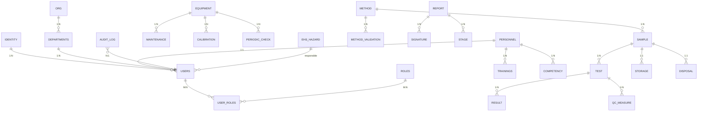

# 02 - 数据库设计（DATABASE）

> **数据库**: PostgreSQL 16
> **ORM**: Prisma 5
> **模型数**: 11 个域 / 60+ 表
> **版本**: v1.0.0
> **日期**: 2026-08-03

---

## 1. 设计原则

1. **ACID**：所有业务表用 InnoDB（PG 默认）
2. **规范化**：3NF 为基线，按场景反规范化
3. **软删除**：重要数据不 DELETE，标记 `deleted_at`
4. **审计字段**：每张表都有 `created_at`/`updated_at`/`created_by`/`updated_by`
5. **UUID 主键**：避免序列号暴露业务量
6. **索引**：高频查询字段必有索引
7. **分区**：大数据表按时间分区
8. **外键**：保持引用完整性

## 2. 域模型（11 个）



## 3. 核心表（按域）

### 3.1 identity 域

#### users
```sql
CREATE TABLE users (
  id UUID PRIMARY KEY DEFAULT gen_random_uuid(),
  username VARCHAR(50) UNIQUE NOT NULL,
  email VARCHAR(100) UNIQUE NOT NULL,
  password_hash VARCHAR(255) NOT NULL,
  name VARCHAR(50) NOT NULL,
  phone VARCHAR(20),
  dept_id UUID REFERENCES departments(id),
  title VARCHAR(50),
  role VARCHAR(20) NOT NULL DEFAULT 'analyst', -- admin/manager/analyst/intern
  status VARCHAR(20) NOT NULL DEFAULT 'active',
  mfa_secret VARCHAR(32),  -- TOTP secret
  mfa_enabled BOOLEAN DEFAULT false,
  last_login_at TIMESTAMPTZ,
  last_login_ip INET,
  created_at TIMESTAMPTZ NOT NULL DEFAULT now(),
  updated_at TIMESTAMPTZ NOT NULL DEFAULT now(),
  created_by UUID REFERENCES users(id),
  updated_by UUID REFERENCES users(id),
  deleted_at TIMESTAMPTZ
);

CREATE INDEX idx_users_username ON users(username) WHERE deleted_at IS NULL;
CREATE INDEX idx_users_email ON users(email) WHERE deleted_at IS NULL;
CREATE INDEX idx_users_dept ON users(dept_id);
```

#### user_sessions
```sql
CREATE TABLE user_sessions (
  id UUID PRIMARY KEY DEFAULT gen_random_uuid(),
  user_id UUID NOT NULL REFERENCES users(id) ON DELETE CASCADE,
  refresh_token_hash VARCHAR(255) NOT NULL,
  user_agent TEXT,
  ip INET,
  expires_at TIMESTAMPTZ NOT NULL,
  revoked BOOLEAN DEFAULT false,
  created_at TIMESTAMPTZ NOT NULL DEFAULT now()
);

CREATE INDEX idx_sessions_user ON user_sessions(user_id);
CREATE INDEX idx_sessions_expires ON user_sessions(expires_at) WHERE revoked = false;
```

#### audit_logs（**SHA256 链**）
```sql
CREATE TABLE audit_logs (
  id BIGSERIAL PRIMARY KEY,
  user_id UUID NOT NULL REFERENCES users(id),
  username VARCHAR(50) NOT NULL,  -- 冗余存储，避免 user 删除后丢失
  action VARCHAR(100) NOT NULL,  -- e.g. 'sample.received'
  table_name VARCHAR(50),
  record_id UUID,
  old_data JSONB,
  new_data JSONB,
  ip INET,
  prev_hash CHAR(64) NOT NULL,  -- SHA256 hex
  curr_hash CHAR(64) NOT NULL,
  created_at TIMESTAMPTZ NOT NULL DEFAULT now()
);

CREATE INDEX idx_audit_user_time ON audit_logs(user_id, created_at DESC);
CREATE INDEX idx_audit_table_record ON audit_logs(table_name, record_id);
CREATE INDEX idx_audit_action ON audit_logs(action);

-- 触发器：阻止 UPDATE/DELETE（append-only）
CREATE OR REPLACE FUNCTION audit_logs_no_modify()
RETURNS TRIGGER AS $$
BEGIN
  RAISE EXCEPTION 'audit_logs is append-only';
END;
$$ LANGUAGE plpgsql;

CREATE TRIGGER trg_audit_no_update BEFORE UPDATE ON audit_logs
  FOR EACH ROW EXECUTE FUNCTION audit_logs_no_modify();
CREATE TRIGGER trg_audit_no_delete BEFORE DELETE ON audit_logs
  FOR EACH ROW EXECUTE FUNCTION audit_logs_no_modify();
```

### 3.2 organization 域

#### departments
```sql
CREATE TABLE departments (
  id UUID PRIMARY KEY DEFAULT gen_random_uuid(),
  name VARCHAR(100) NOT NULL,
  code VARCHAR(20) UNIQUE NOT NULL,
  parent_id UUID REFERENCES departments(id),
  manager_id UUID REFERENCES users(id),
  description TEXT,
  created_at TIMESTAMPTZ NOT NULL DEFAULT now(),
  updated_at TIMESTAMPTZ NOT NULL DEFAULT now(),
  deleted_at TIMESTAMPTZ
);

CREATE INDEX idx_dept_parent ON departments(parent_id);
```

### 3.3 personnel 域

#### personnel
```sql
CREATE TABLE personnel (
  id UUID PRIMARY KEY DEFAULT gen_random_uuid(),
  user_id UUID UNIQUE NOT NULL REFERENCES users(id) ON DELETE CASCADE,
  employee_no VARCHAR(20) UNIQUE NOT NULL,
  name VARCHAR(50) NOT NULL,
  gender CHAR(1),
  birth_date DATE,
  id_card VARCHAR(20),
  phone VARCHAR(20),
  email VARCHAR(100),
  education VARCHAR(50),
  title VARCHAR(50),
  cert_no VARCHAR(50),
  hiredate DATE,
  status VARCHAR(20) DEFAULT 'active',
  created_at TIMESTAMPTZ NOT NULL DEFAULT now(),
  updated_at TIMESTAMPTZ NOT NULL DEFAULT now(),
  deleted_at TIMESTAMPTZ
);
```

#### trainings
```sql
CREATE TABLE trainings (
  id UUID PRIMARY KEY DEFAULT gen_random_uuid(),
  personnel_id UUID NOT NULL REFERENCES personnel(id) ON DELETE CASCADE,
  training_type VARCHAR(50) NOT NULL,
  training_name VARCHAR(200) NOT NULL,
  training_date DATE NOT NULL,
  duration_hours DECIMAL(5,2),
  trainer VARCHAR(100),
  content TEXT,
  result VARCHAR(20), -- pass/fail/excellent
  certificate_no VARCHAR(50),
  certificate_file_id UUID REFERENCES file_attachments(id),
  valid_until DATE,
  created_at TIMESTAMPTZ NOT NULL DEFAULT now()
);

CREATE INDEX idx_trainings_personnel ON trainings(personnel_id);
CREATE INDEX idx_trainings_date ON trainings(training_date);
```

#### competency（人员能力矩阵）
```sql
CREATE TABLE competency (
  id UUID PRIMARY KEY DEFAULT gen_random_uuid(),
  personnel_id UUID NOT NULL REFERENCES personnel(id),
  project_id UUID NOT NULL REFERENCES projects(id),
  competency_level VARCHAR(20) NOT NULL, -- trainee/qualified/supervisor
  authorized_at TIMESTAMPTZ,
  authorized_by UUID REFERENCES users(id),
  valid_until TIMESTAMPTZ,
  assessment_id UUID REFERENCES competency_assessments(id),
  status VARCHAR(20) DEFAULT 'active', -- active/suspended/revoked
  created_at TIMESTAMPTZ NOT NULL DEFAULT now()
);

CREATE UNIQUE INDEX idx_competency_unique ON competency(personnel_id, project_id)
  WHERE status = 'active';
```

### 3.4 equipment 域

#### equipment
```sql
CREATE TABLE equipment (
  id UUID PRIMARY KEY DEFAULT gen_random_uuid(),
  equip_no VARCHAR(50) UNIQUE NOT NULL,
  equip_name VARCHAR(200) NOT NULL,
  model VARCHAR(100),
  manufacturer VARCHAR(100),
  serial_no VARCHAR(50),
  purchase_date DATE,
  purchase_price DECIMAL(12,2),
  current_value DECIMAL(12,2),
  location VARCHAR(200),
  dept_id UUID REFERENCES departments(id),
  state VARCHAR(30) NOT NULL DEFAULT 'procurement', 
    -- procurement/acceptance/qualified/in-use/maintenance/broken/retired
  responsible_person UUID REFERENCES users(id),
  next_calib_date DATE,
  next_maintain_date DATE,
  created_at TIMESTAMPTZ NOT NULL DEFAULT now(),
  updated_at TIMESTAMPTZ NOT NULL DEFAULT now(),
  deleted_at TIMESTAMPTZ
);

CREATE INDEX idx_equipment_state ON equipment(state);
CREATE INDEX idx_equipment_dept ON equipment(dept_id);
CREATE INDEX idx_equipment_next_calib ON equipment(next_calib_date);
```

#### equipment_maintenance
```sql
CREATE TABLE equipment_maintenance (
  id UUID PRIMARY KEY DEFAULT gen_random_uuid(),
  equip_id UUID NOT NULL REFERENCES equipment(id),
  maintenance_type VARCHAR(30) NOT NULL, -- calibration/maintenance/repair/check
  maintenance_date DATE NOT NULL,
  maintainer VARCHAR(100) NOT NULL,
  cost DECIMAL(10,2),
  content TEXT,
  result VARCHAR(20),
  next_maintenance_date DATE,
  file_id UUID REFERENCES file_attachments(id),
  created_at TIMESTAMPTZ NOT NULL DEFAULT now(),
  created_by UUID REFERENCES users(id)
);
```

#### equipment_calibration
```sql
CREATE TABLE equipment_calibration (
  id UUID PRIMARY KEY DEFAULT gen_random_uuid(),
  equip_id UUID NOT NULL REFERENCES equipment(id),
  calibration_date DATE NOT NULL,
  calibration_org VARCHAR(200) NOT NULL,
  certificate_no VARCHAR(50),
  valid_date DATE,
  result VARCHAR(20),
  uncertainty TEXT,
  file_id UUID REFERENCES file_attachments(id),
  created_at TIMESTAMPTZ NOT NULL DEFAULT now()
);
```

#### equipment_periodic_check（期间核查）
```sql
CREATE TABLE equipment_periodic_check (
  id UUID PRIMARY KEY DEFAULT gen_random_uuid(),
  equip_id UUID NOT NULL REFERENCES equipment(id),
  check_date DATE NOT NULL,
  check_type VARCHAR(50),
  result VARCHAR(20),
  deviation DECIMAL(10,4),
  z_score DECIMAL(5,2),
  operator_id UUID REFERENCES users(id),
  created_at TIMESTAMPTZ NOT NULL DEFAULT now()
);
```

### 3.5 method 域

#### projects（检测方法）
```sql
CREATE TABLE projects (
  id UUID PRIMARY KEY DEFAULT gen_random_uuid(),
  project_no VARCHAR(50) UNIQUE NOT NULL,
  project_name VARCHAR(200) NOT NULL,
  method_type VARCHAR(50),  -- ICP/GC-MS/HPLC/...
  standard_reference VARCHAR(100),  -- GB/T 5009.X
  is_standard BOOLEAN DEFAULT true,
  description TEXT,
  created_at TIMESTAMPTZ NOT NULL DEFAULT now(),
  deleted_at TIMESTAMPTZ
);
```

#### method_validations（方法验证）
```sql
CREATE TABLE method_validations (
  id UUID PRIMARY KEY DEFAULT gen_random_uuid(),
  project_id UUID NOT NULL REFERENCES projects(id),
  validation_type VARCHAR(30) NOT NULL, -- verification/validation
  lod DECIMAL(15,6),  -- 检出限
  loq DECIMAL(15,6),  -- 测定下限
  linear_range_low DECIMAL(15,6),
  linear_range_high DECIMAL(15,6),
  r2_coefficient DECIMAL(5,4),
  repeatability_rsd DECIMAL(5,2),  -- 重复性 RSD%
  reproducibility_rsd DECIMAL(5,2),  -- 再现性 RSD%
  recovery_pct DECIMAL(5,2),  -- 加标回收率%
  uncertainty TEXT,  -- U=X, k=2
  validated_at DATE,
  validated_by UUID REFERENCES users(id),
  file_id UUID REFERENCES file_attachments(id),
  created_at TIMESTAMPTZ NOT NULL DEFAULT now()
);
```

#### standard_substances（标准物质）
```sql
CREATE TABLE standard_substances (
  id UUID PRIMARY KEY DEFAULT gen_random_uuid(),
  certificate_no VARCHAR(50) UNIQUE NOT NULL,  -- GBW 08645
  substance_name VARCHAR(200) NOT NULL,
  cas_no VARCHAR(50),
  concentration VARCHAR(100),
  uncertainty VARCHAR(50),
  manufacturer VARCHAR(200),
  lot_no VARCHAR(50),
  valid_date DATE,
  alert_days INT DEFAULT 30,
  file_id UUID REFERENCES file_attachments(id),
  status VARCHAR(20) DEFAULT 'active',
  created_at TIMESTAMPTZ NOT NULL DEFAULT now()
);

CREATE INDEX idx_std_cert ON standard_substances(certificate_no);
CREATE INDEX idx_std_valid ON standard_substances(valid_date);
```

### 3.6 sample 域

#### samples
```sql
CREATE TABLE samples (
  id UUID PRIMARY KEY DEFAULT gen_random_uuid(),
  sample_code VARCHAR(50) UNIQUE NOT NULL,  -- 唯一编号
  sample_name VARCHAR(200) NOT NULL,
  sample_type VARCHAR(50) NOT NULL,
  client_name VARCHAR(200),
  client_contact VARCHAR(100),
  project_id UUID REFERENCES projects(id),
  state VARCHAR(30) NOT NULL DEFAULT 'received',  -- 状态机
  received_at TIMESTAMPTZ NOT NULL DEFAULT now(),
  received_by UUID REFERENCES users(id),
  test_method TEXT,
  test_item TEXT,
  priority VARCHAR(20) DEFAULT 'normal',  -- low/normal/high/urgent
  created_at TIMESTAMPTZ NOT NULL DEFAULT now(),
  updated_at TIMESTAMPTZ NOT NULL DEFAULT now(),
  deleted_at TIMESTAMPTZ
);

-- 编号前缀（按年/月）
CREATE INDEX idx_samples_code ON samples(sample_code);
CREATE INDEX idx_samples_state ON samples(state);
CREATE INDEX idx_samples_received_at ON samples(received_at DESC);
CREATE INDEX idx_samples_client ON samples(client_name);
```

#### sample_storage
```sql
CREATE TABLE sample_storage (
  id UUID PRIMARY KEY DEFAULT gen_random_uuid(),
  sample_id UUID UNIQUE NOT NULL REFERENCES samples(id),
  location VARCHAR(100),  -- 冰箱-A-01
  temperature DECIMAL(5,2),
  humidity DECIMAL(5,2),
  retention_until DATE,  -- 留样到期
  storage_condition VARCHAR(50),  -- normal/refrigerated/frozen
  photo_id UUID REFERENCES file_attachments(id),
  disposed_at TIMESTAMPTZ,
  disposal_method VARCHAR(50),  -- incineration/recycle/return
  created_at TIMESTAMPTZ NOT NULL DEFAULT now()
);
```

#### sample_disposal（样品处置）
```sql
CREATE TABLE sample_disposal (
  id UUID PRIMARY KEY DEFAULT gen_random_uuid(),
  sample_id UUID REFERENCES samples(id),
  storage_id UUID REFERENCES sample_storage(id),
  disposal_date DATE NOT NULL,
  disposal_method VARCHAR(50) NOT NULL,
  operator_id UUID REFERENCES users(id),
  witness_id UUID REFERENCES users(id),
  remark TEXT,
  created_at TIMESTAMPTZ NOT NULL DEFAULT now()
);
```

### 3.7 test 域

#### tests（检测任务）
```sql
CREATE TABLE tests (
  id UUID PRIMARY KEY DEFAULT gen_random_uuid(),
  test_no VARCHAR(50) UNIQUE NOT NULL,
  sample_id UUID NOT NULL REFERENCES samples(id),
  project_id UUID NOT NULL REFERENCES projects(id),
  test_method TEXT,
  state VARCHAR(30) NOT NULL DEFAULT 'pending',
    -- pending/running/completed/reviewed/approved/rejected
  assigned_to UUID REFERENCES users(id),
  started_at TIMESTAMPTZ,
  completed_at TIMESTAMPTZ,
  reviewed_by UUID REFERENCES users(id),
  reviewed_at TIMESTAMPTZ,
  approved_by UUID REFERENCES users(id),
  approved_at TIMESTAMPTZ,
  conclusion TEXT,
  created_at TIMESTAMPTZ NOT NULL DEFAULT now(),
  updated_at TIMESTAMPTZ NOT NULL DEFAULT now(),
  deleted_at TIMESTAMPTZ
);

CREATE INDEX idx_tests_sample ON tests(sample_id);
CREATE INDEX idx_tests_state ON tests(state);
CREATE INDEX idx_tests_assigned ON tests(assigned_to);
```

#### test_results
```sql
CREATE TABLE test_results (
  id UUID PRIMARY KEY DEFAULT gen_random_uuid(),
  test_id UUID NOT NULL REFERENCES tests(id) ON DELETE CASCADE,
  analyte VARCHAR(200) NOT NULL,  -- 分析物
  value DECIMAL(15,6),
  unit VARCHAR(20),
  limit_value DECIMAL(15,6),  -- 限量
  judgement VARCHAR(20),  -- pass/fail/uncertain
  method VARCHAR(100),
  equipment_id UUID REFERENCES equipment(id),
  reagent_lot VARCHAR(50),
  remark TEXT,
  created_at TIMESTAMPTZ NOT NULL DEFAULT now(),
  created_by UUID REFERENCES users(id)
);

CREATE INDEX idx_results_test ON test_results(test_id);
```

#### qc_samples（质控样）
```sql
CREATE TABLE qc_samples (
  id UUID PRIMARY KEY DEFAULT gen_random_uuid(),
  qc_no VARCHAR(50) UNIQUE NOT NULL,
  project_id UUID NOT NULL REFERENCES projects(id),
  analyte VARCHAR(200) NOT NULL,
  expected_value DECIMAL(15,6),
  expected_sd DECIMAL(15,6),
  unit VARCHAR(20),
  lot_no VARCHAR(50),
  valid_date DATE,
  created_at TIMESTAMPTZ NOT NULL DEFAULT now()
);
```

#### qc_measurements
```sql
CREATE TABLE qc_measurements (
  id UUID PRIMARY KEY DEFAULT gen_random_uuid(),
  qc_id UUID NOT NULL REFERENCES qc_samples(id),
  measurement_date TIMESTAMPTZ NOT NULL DEFAULT now(),
  measured_value DECIMAL(15,6) NOT NULL,
  operator_id UUID REFERENCES users(id),
  equipment_id UUID REFERENCES equipment(id),
  z_score DECIMAL(5,2),  -- 计算字段
  rule_violations TEXT,  -- JSON 数组
  status VARCHAR(20),  -- in-control/warning/out-of-control
  remark TEXT
);

CREATE INDEX idx_qc_meas_qc ON qc_measurements(qc_id, measurement_date DESC);
```

### 3.8 report 域

#### reports
```sql
CREATE TABLE reports (
  id UUID PRIMARY KEY DEFAULT gen_random_uuid(),
  report_no VARCHAR(50) UNIQUE NOT NULL,
  test_id UUID NOT NULL REFERENCES tests(id),
  sample_id UUID NOT NULL REFERENCES samples(id),
  client_name VARCHAR(200) NOT NULL,
  issue_date DATE,
  state VARCHAR(30) DEFAULT 'draft',  -- draft/reviewing/approved/issued/revised
  pdf_file_id UUID REFERENCES file_attachments(id),
  created_at TIMESTAMPTZ NOT NULL DEFAULT now(),
  updated_at TIMESTAMPTZ NOT NULL DEFAULT now(),
  deleted_at TIMESTAMPTZ
);
```

#### report_signatures（多级审核签名）
```sql
CREATE TABLE report_signatures (
  id UUID PRIMARY KEY DEFAULT gen_random_uuid(),
  report_id UUID NOT NULL REFERENCES reports(id) ON DELETE CASCADE,
  stage VARCHAR(30) NOT NULL,  -- tester/reviewer/auditor/approver
  user_id UUID NOT NULL REFERENCES users(id),
  cert_serial VARCHAR(100) NOT NULL,
  signature BYTEA NOT NULL,  -- CA 签名
  timestamp_token BYTEA NOT NULL,  -- TSA 时间戳
  hash CHAR(64) NOT NULL,  -- 报告 SHA256
  signed_at TIMESTAMPTZ NOT NULL DEFAULT now()
);

CREATE UNIQUE INDEX idx_signatures_stage ON report_signatures(report_id, stage);
```

#### report_revisions（修订历史）
```sql
CREATE TABLE report_revisions (
  id UUID PRIMARY KEY DEFAULT gen_random_uuid(),
  report_id UUID NOT NULL REFERENCES reports(id),
  version INT NOT NULL,
  reason TEXT,
  revised_by UUID REFERENCES users(id),
  revised_at TIMESTAMPTZ NOT NULL DEFAULT now(),
  pdf_file_id UUID REFERENCES file_attachments(id)
);
```

### 3.9 ehs 域

#### ehs_hazards（隐患）
```sql
CREATE TABLE ehs_hazards (
  id UUID PRIMARY KEY DEFAULT gen_random_uuid(),
  discovery_date DATE NOT NULL,
  hazard_location VARCHAR(200) NOT NULL,
  hazard_type VARCHAR(50) NOT NULL,
  severity_level VARCHAR(20) NOT NULL,  -- low/medium/high
  description TEXT NOT NULL,
  control_measures TEXT,
  responsible_person UUID REFERENCES users(id),
  deadline DATE,
  state VARCHAR(20) DEFAULT 'open',  -- open/investigating/resolved
  closed_at TIMESTAMPTZ,
  created_at TIMESTAMPTZ NOT NULL DEFAULT now(),
  created_by UUID REFERENCES users(id)
);
```

#### ehs_inspections（巡检）
```sql
CREATE TABLE ehs_inspections (
  id UUID PRIMARY KEY DEFAULT gen_random_uuid(),
  inspection_date DATE NOT NULL,
  inspector_id UUID NOT NULL REFERENCES users(id),
  area VARCHAR(100) NOT NULL,
  fire_facilities VARCHAR(20),
  temp_value DECIMAL(5,2),
  humidity_value DECIMAL(5,2),
  ventilation_status VARCHAR(20),
  electrical_safety VARCHAR(20),
  chemical_storage VARCHAR(20),
  overall_status VARCHAR(20),
  remark TEXT,
  created_at TIMESTAMPTZ NOT NULL DEFAULT now()
);
```

### 3.10 system 域

#### file_attachments
```sql
CREATE TABLE file_attachments (
  id UUID PRIMARY KEY DEFAULT gen_random_uuid(),
  file_name VARCHAR(255) NOT NULL,
  file_path VARCHAR(500) NOT NULL,  -- MinIO path
  file_size BIGINT,
  mime_type VARCHAR(100),
  file_hash CHAR(64),  -- SHA256
  bucket VARCHAR(100) DEFAULT 'lims-files',
  uploaded_by UUID REFERENCES users(id),
  uploaded_at TIMESTAMPTZ NOT NULL DEFAULT now(),
  deleted_at TIMESTAMPTZ
);

CREATE INDEX idx_files_hash ON file_attachments(file_hash);
```

#### notifications
```sql
CREATE TABLE notifications (
  id UUID PRIMARY KEY DEFAULT gen_random_uuid(),
  user_id UUID NOT NULL REFERENCES users(id),
  type VARCHAR(50) NOT NULL,  -- equipment_calib/standard_expiring/sample_overdue/...
  ref_table VARCHAR(50),
  ref_id UUID,
  title VARCHAR(200) NOT NULL,
  content TEXT,
  read_at TIMESTAMPTZ,
  created_at TIMESTAMPTZ NOT NULL DEFAULT now()
);

CREATE INDEX idx_notif_user_unread ON notifications(user_id, read_at) 
  WHERE read_at IS NULL;
```

#### system_configs
```sql
CREATE TABLE system_configs (
  key VARCHAR(100) PRIMARY KEY,
  value JSONB NOT NULL,
  description TEXT,
  updated_at TIMESTAMPTZ NOT NULL DEFAULT now(),
  updated_by UUID REFERENCES users(id)
);
```

## 4. 索引策略

### 4.1 索引原则

- 高频查询字段必有索引
- 外键必有索引
- 复合索引顺序：高频 + 低基数在前
- 避免过多索引（影响写入）

### 4.2 关键索引清单

| 表 | 索引 | 字段 |
|---|---|---|
| users | idx_users_username | username (unique partial) |
| audit_logs | idx_audit_user_time | user_id, created_at DESC |
| samples | idx_samples_code | sample_code (unique) |
| tests | idx_tests_sample_state | sample_id, state |
| test_results | idx_results_test | test_id |
| qc_measurements | idx_qc_meas_qc | qc_id, measurement_date DESC |
| equipment | idx_equipment_next_calib | next_calib_date |

## 5. 迁移策略

### 5.1 Prisma 迁移

```bash
# 1. 修改 schema.prisma
# 2. 生成迁移
npx prisma migrate dev --name add_qc_module

# 3. 在测试环境跑
DATABASE_URL=postgres://test npx prisma migrate deploy

# 4. 在生产环境跑
DATABASE_URL=postgres://prod npx prisma migrate deploy
```

### 5.2 数据迁移（CNAS 升级）

```typescript
// scripts/migrate-audit-chain.ts
import { PrismaClient } from '@prisma/client';
import { createHash } from 'crypto';

const prisma = new PrismaClient();

async function migrateAuditChain() {
  const logs = await prisma.auditLog.findMany({ orderBy: { id: 'asc' } });
  let prev = '0'.repeat(64);
  
  await prisma.$transaction(async (tx) => {
    for (const log of logs) {
      const data = JSON.stringify({
        ts: log.createdAt,
        userId: log.userId,
        action: log.action,
        tableName: log.tableName,
        recordId: log.recordId,
        oldData: log.oldData,
        newData: log.newData
      });
      const curr = createHash('sha256').update(prev + data).digest('hex');
      await tx.auditLog.update({
        where: { id: log.id },
        data: { prevHash: prev, currHash: curr }
      });
      prev = curr;
    }
  });
  
  console.log(`Migrated ${logs.length} audit logs`);
}

migrateAuditChain();
```

## 6. 数据完整性

### 6.1 约束

- NOT NULL：必填字段
- UNIQUE：业务唯一
- CHECK：值域检查
- FOREIGN KEY：参照完整性
- TRIGGER：复杂约束

### 6.2 示例

```sql
-- 检查：检测值必须 ≥ 检出限
ALTER TABLE test_results ADD CONSTRAINT chk_result_above_lod 
  CHECK (value >= (SELECT lod FROM method_validations WHERE project_id = test_results.test_id));

-- 检查：有效期 > 当前日期
ALTER TABLE standard_substances ADD CONSTRAINT chk_valid_future 
  CHECK (valid_date > CURRENT_DATE);

-- 触发器：自动计算 z_score
CREATE OR REPLACE FUNCTION calc_z_score()
RETURNS TRIGGER AS $$
BEGIN
  NEW.z_score := (NEW.measured_value - 
    (SELECT expected_value FROM qc_samples WHERE id = NEW.qc_id)) /
    NULLIF((SELECT expected_sd FROM qc_samples WHERE id = NEW.qc_id), 0);
  RETURN NEW;
END;
$$ LANGUAGE plpgsql;

CREATE TRIGGER trg_qc_z_score BEFORE INSERT ON qc_measurements
  FOR EACH ROW EXECUTE FUNCTION calc_z_score();
```

## 7. 性能调优

### 7.1 查询优化

- **避免 SELECT ***：只取需要的字段
- **分页**：用 `LIMIT/OFFSET` 或 cursor-based
- **批量操作**：用 `INSERT INTO ... VALUES (...), (...)`
- **索引覆盖**：让索引包含所有 SELECT 字段

### 7.2 表分区

```sql
-- 按月分区 audit_logs（大表）
CREATE TABLE audit_logs_partitioned (LIKE audit_logs INCLUDING ALL)
PARTITION BY RANGE (created_at);

CREATE TABLE audit_logs_2026_08 PARTITION OF audit_logs_partitioned
  FOR VALUES FROM ('2026-08-01') TO ('2026-09-01');
```

### 7.3 归档策略

- audit_logs 1 年后归档到 audit_logs_archive
- test_results 5 年后归档
- 文件 > 2 年压缩到冷存储

## 8. 备份策略（详见 05）

| 频率 | 类型 | 保留 |
|---|---|---|
| 每日 | 全量 | 30 天 |
| 每周 | 全量异地 | 1 年 |
| 实时 | WAL 归档 | 7 天 |
| 每月 | 异地加密 | 永久 |

## 9. 附录

- [架构设计](01-ARCHITECTURE.md)
- [API 规范](03-API.md)
- [CNAS 合规](04-CNAS-COMPLIANCE.md)
- [部署架构](05-DEPLOYMENT.md)
- [实施路线图](06-ROADMAP.md)
