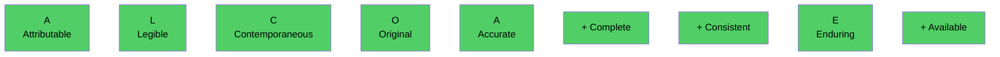
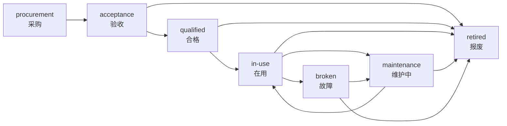

# 04 - CNAS 合规设计(CNAS COMPLIANCE)

> **标准**: ISO/IEC 17025:2017 + CNAS-CL01:2018 + 21 CFR Part 11
> **数据完整性**: ALCOA+
> **业务**: 贵金属(黄金)检测 —— 火试金法 + ICP(详见 [ADR-0011](./adr/0011-precious-metal-business.md))
> **版本**: v2.0.0
> **日期**: 2026-08-04
> **维护者**: 天枢(架构师)

---

## 0. 快速索引(给 CNAS 审核员)

| 审核关注点 | 本文档章节 | 代码落地 | 现场演示 |
|---|---|---|---|
| ALCOA+ 9 原则 | §2 | 数据库触发器 + 审计中间件 | `GET /audit-logs/verify` |
| 审计链完整性 | §3.1 | PG 触发器 SHA256 链 | `GET /audit-logs/verify` |
| 电子签名 | §3.2 | 第三方 CA 服务 | PDF 内嵌证书 |
| 多级审核 | §3.3 | XState 状态机 | `GET /reports/:id/stages` |
| 备份恢复 | §3.4 | 全量+增量+异地 | `scripts/restore.sh` |
| 访问控制 | §3.5 | JWT + MFA + RBAC | 登录 + RBAC 守卫 |
| 数据完整性 | §3.6 | DB 触发器 + 事务 | 任意写操作自动审计 |
| 时钟同步 | §3.7 | NTP + PostgreSQL | `SELECT now()` |

> **本版本(v2.0)新增**:`§0 快速索引` + 每节末尾的"代码落地映射"小节,方便 CNAS 审核员按图索骥。

---

## 1. 标准清单

| 标准 | 全称 | 适用范围 |
|---|---|---|
| **ISO/IEC 17025:2017** | 检测和校准实验室能力的通用要求 | 主体 |
| **CNAS-CL01:2018** | 检测和校准实验室能力认可准则 | 中国版 |
| **CNAS-GL001:2018** | 实验室内部审核指南 | 审核 |
| **CNAS-GL002:2018** | 实验室管理评审指南 | 评审 |
| **21 CFR Part 11** | 电子记录与电子签名（FDA） | 参考 |
| **EU GMP Annex 11** | 计算机化系统 | 参考 |
| **GAMP 5** | GxP 计算机化系统验证 | 参考 |
| **GB/T 27025-2019** | 中国等同采用 ISO 17025 | 国家标准 |

## 2. ALCOA+ 数据完整性 9 原则

### 2.1 原则总览



| 原则 | 含义 | LIMS 实现 |
|---|---|---|
| **A** ttributable | 可归因到人 | user_id + 强制登录 + 审计 |
| **L** egible | 清晰可读 | UTF-8 + 数字签名 + 不可改 |
| **C** ontemporaneous | 同步记录 | NTP + 自动时间戳 |
| **O** riginal | 原始数据 | append-only + 不可改 |
| **A** ccurate | 准确 | 多级审核 + 校核 |
| **+ Complete** | 完整 | Zod 必填 + 缺字段拦截 |
| **+ Consistent** | 一致 | 跨表 FK + 事务 |
| **+ Enduring** | 持久 | PostgreSQL + WAL + 异地备份 |
| **+ Available** | 可用 | 灾备 + SLA 99.99% |

### 2.2 ALCOA+ 检查清单

- [ ] 所有创建/修改/删除操作记录 user_id
- [ ] 所有数据带 NTP 同步时间戳
- [ ] 原始数据不可修改（append-only）
- [ ] 必填字段通过 Zod schema 强制
- [ ] 跨表数据一致（FK + 事务）
- [ ] 数据库持久化 + 异地备份
- [ ] 系统 7×24 可用

## 3. 11 横切模块详细设计

### 3.1 审计追踪（Audit Trail）

**CNAS 条款**: ISO 17025 §7.5 技术记录, §7.11.2 数据控制
**ALCOA+**: Original, Enduring, Complete

#### 3.1.1 设计目标

- ✅ SHA256 hash chain（防篡改）
- ✅ append-only（DB 触发器阻止 UPDATE/DELETE）
- ✅ 独立 verify 工具
- ✅ 自动写入（所有 ORM 操作）
- ✅ 5 年保留 + 异地备份

#### 3.1.2 表结构

```sql
CREATE TABLE audit_logs (
  id BIGSERIAL PRIMARY KEY,
  user_id UUID NOT NULL REFERENCES users(id),
  username VARCHAR(50) NOT NULL,  -- 冗余存储
  action VARCHAR(100) NOT NULL,
  table_name VARCHAR(50),
  record_id UUID,
  old_data JSONB,
  new_data JSONB,
  ip INET,
  prev_hash CHAR(64) NOT NULL,
  curr_hash CHAR(64) NOT NULL,
  created_at TIMESTAMPTZ NOT NULL DEFAULT now()
);

-- 触发器
CREATE OR REPLACE FUNCTION audit_logs_no_modify() RETURNS TRIGGER AS $$
BEGIN
  RAISE EXCEPTION 'audit_logs is append-only (CNAS compliance)';
END;
$$ LANGUAGE plpgsql;

CREATE TRIGGER trg_audit_no_update BEFORE UPDATE ON audit_logs
  FOR EACH ROW EXECUTE FUNCTION audit_logs_no_modify();
CREATE TRIGGER trg_audit_no_delete BEFORE DELETE ON audit_logs
  FOR EACH ROW EXECUTE FUNCTION audit_logs_no_modify();
```

#### 3.1.3 Hash 计算

```typescript
function computeHash(prevHash: string, entry: AuditEntry): string {
  const data = JSON.stringify({
    ts: entry.ts,
    userId: entry.userId,
    action: entry.action,
    tableName: entry.tableName,
    recordId: entry.recordId,
    oldData: entry.oldData,
    newData: entry.newData
  });
  return createHash('sha256').update(prevHash + data).digest('hex');
}
```

#### 3.1.4 验证

```typescript
async function verify(): Promise<{valid: boolean, brokenAt?: number}> {
  const logs = await this.prisma.auditLog.findMany({ orderBy: { id: 'asc' } });
  let prev = '0'.repeat(64);
  for (const log of logs) {
    if (log.prevHash !== prev) return { valid: false, brokenAt: log.id };
    const data = JSON.stringify({...});
    const expected = computeHash(prev, log);
    if (log.currHash !== expected) return { valid: false, brokenAt: log.id };
    prev = log.currHash;
  }
  return { valid: true };
}
```

#### 3.1.5 验收标准

- ✅ 每次 INSERT 自动计算 SHA256
- ✅ 验证脚本可检测篡改
- ✅ UPDATE/DELETE 被 DB 拒绝
- ✅ 历史数据迁移完整

### 3.2 电子签名（E-Signature）

**CNAS 条款**: ISO 17025 §7.8.2 报告意见与解释
**法律依据**: 《电子签名法》第十三条 + 《电子认证服务管理办法》

#### 3.2.1 多级审核链

```
检测员 → 校核人 → 审核人 → 批准人
tester   reviewer  auditor   approver
```

每级必须单独签名，全部完成后报告才能发布。

#### 3.2.2 CA 证书

- **国密 SM2/SM3**（中国标准，推荐）
- **RSA/ECDSA**（国际通用，备选）
- 证书格式：X.509v3
- 存储：HashiCorp Vault
- 定期更换：1-2 年

#### 3.2.3 时间戳（TSA）

- **国家授时中心** TSA（推荐）
- 协议：RFC 3161
- 格式：base64-encoded TimeStampToken

#### 3.2.4 PDF 签名嵌入

```typescript
async function signReport(reportId: string, stage: string, userId: string) {
  // 1. 计算报告 hash
  const report = await this.getReport(reportId);
  const hash = sha256(JSON.stringify(report));
  
  // 2. 获取 TSA 时间戳
  const timestamp = await this.requestTSA(hash);
  
  // 3. 用用户私钥签名
  const signData = `${hash}|${timestamp}|${stage}`;
  const signature = crypto.sign('RSA-SHA256', Buffer.from(signData), userCert.privateKey);
  
  // 4. 存储签名
  await this.prisma.reportSignature.create({
    data: {
      reportId, stage, userId,
      certSerial: userCert.serial,
      signature, timestamp, hash,
      signedAt: new Date()
    }
  });
}
```

#### 3.2.5 验收标准

- ✅ 4 级必须都签才能发布
- ✅ PDF 嵌入 CA 签名（Adobe Reader 可验）
- ✅ TSA 时间戳权威可信
- ✅ 签名不可伪造/重放

### 3.3 质量控制（QC）

**CNAS 条款**: ISO 17025 §7.7 结果有效性
**核心要求**: 内部质量控制（IQC）+ 外部质量控制（EQC）

#### 3.3.1 4 类质控样

| 类型 | 用途 | 接受标准 |
|---|---|---|
| **空白** (method blank) | 试剂/环境本底 | < LOD |
| **平行样** (duplicate) | 精密度 | RSD < 5% |
| **加标回收** (spike) | 准确度 | 80-120% |
| **QC 样** (QC sample) | 长期监控 | Z-score < 2 |

#### 3.3.2 6σ 趋势图（Levey-Jennings）

```
        ±3SD ──────────────────
              ╱ ╲     ╱╲
             ╱   ╲   ╱  ╲    ╱
   ±2SD ───╱─────╲─╱────╲──╱──
           ╱       ╳     ╲╱
   Mean ──╱───────╱───────╲──
         ╱      ╱ ╲
   -2SD ──────╱───╲─────────
              ╲  ╱
   -3SD ──────╲╱────────────
```

#### 3.3.3 Westgard 规则

| 规则 | 标准 | 含义 | 行动 |
|---|---|---|---|
| **1₃s** | 1 点超出 ±3SD | 警告 | 警告 |
| **2₂s** | 连续 2 点超同侧 ±2SD | 失控 | 阻止发布 |
| **R₄s** | 连续 2 点差值 > 4SD | 失控 | 阻止发布 |
| **4₁s** | 连续 4 点超同侧 ±1SD | 失控 | 阻止发布 |
| **10x̄** | 连续 10 点同侧 | 趋势 | 警告 |

```typescript
// qc.monitor.ts
class QCMonitor {
  evaluate(measurements: number[], mean: number, sd: number): QCResult {
    const violations: string[] = [];
    
    // 1₃s: 1 点超 ±3SD
    if (measurements.some(x => Math.abs(x - mean) > 3 * sd)) {
      violations.push('1_3s');
    }
    
    // 2₂s: 连续 2 点同侧 ±2SD
    let consec = 0, lastSign = 0;
    for (const x of measurements) {
      const sign = x > mean ? 1 : -1;
      const beyond = Math.abs(x - mean) > 2 * sd;
      if (beyond && sign === lastSign) consec++;
      else { consec = beyond ? 1 : 0; lastSign = sign; }
      if (consec >= 2) { violations.push('2_2s'); break; }
    }
    
    // R₄s: 连续 2 点差值 > 4SD
    for (let i = 1; i < measurements.length; i++) {
      if (Math.abs(measurements[i] - measurements[i-1]) > 4 * sd) {
        violations.push('R_4s'); break;
      }
    }
    
    // 4₁s: 连续 4 点同侧 ±1SD
    consec = 0; lastSign = 0;
    for (const x of measurements) {
      const sign = x > mean ? 1 : -1;
      const beyond = Math.abs(x - mean) > sd;
      if (beyond && sign === lastSign) consec++;
      else { consec = beyond ? 1 : 0; lastSign = sign; }
      if (consec >= 4) { violations.push('4_1s'); break; }
    }
    
    // 10x̄: 连续 10 点同侧
    if (measurements.length >= 10) {
      const last10 = measurements.slice(-10);
      if (last10.every(x => x > mean) || last10.every(x => x < mean)) {
        violations.push('10x');
      }
    }
    
    return {
      ruleViolations: violations,
      status: ['1_3s', '2_2s', 'R_4s', '4_1s'].some(v => violations.includes(v))
        ? 'out-of-control' : violations.length > 0 ? 'warning' : 'in-control',
      mean, sd
    };
  }
}
```

#### 3.3.4 失控处理流程

```
QC 失控
  ↓
自动阻止报告发布
  ↓
通知质量负责人
  ↓
调查原因（设备/试剂/方法/环境）
  ↓
纠正措施（CAPA）
  ↓
重新检测
  ↓
QC 重新评估
  ↓
通过 → 继续；不通过 → 扩大范围
```

#### 3.3.5 验收标准

- ✅ 每次检测自动评估
- ✅ 失控时阻止报告发布
- ✅ 6σ 趋势图实时显示
- ✅ 规则库可配置

### 3.4 备份与灾备

**CNAS 条款**: ISO 17025 §7.11.2 数据控制（备份、灾难恢复）

#### 3.4.1 3-2-1 策略

```
3 份副本
├── 主库 (在线)
├── 本地备份 (近线)
└── 异地备份 (离线)
2 种介质
├── 磁盘 (PostgreSQL WAL)
└── 对象存储 (MinIO/S3)
1 份异地
└── 阿里云 OSS (北京/上海/广州)
```

#### 3.4.2 备份频率

| 类型 | 频率 | 保留 | 加密 |
|---|---|---|---|
| 全量 | 每日 02:00 | 30 天 | AES-256-GCM |
| 增量 | 实时 (WAL) | 7 天 | AES-256 |
| 异地 | 每周 | 1 年 | AES-256 + TLS |
| 归档 | 每月 | 永久 | AES-256 |

#### 3.4.3 恢复演练

- 每月 1 日 03:00 自动演练
- 生成演练报告
- RTO ≤ 4 小时
- RPO ≤ 1 小时

### 3.5 人员能力

**CNAS 条款**: ISO 17025 §6.2 人员

#### 3.5.1 培训年度计划

```sql
CREATE TABLE training_annual_plan (
  id UUID PRIMARY KEY,
  year INT NOT NULL,
  dept_id UUID REFERENCES departments(id),
  total_planned INT,
  total_actual INT,
  ...
);
```

#### 3.5.2 培训记录

| 字段 | 必填 | 说明 |
|---|---|---|
| personnel_id | ✓ | 人员 |
| training_type | ✓ | 内训/外训/在线 |
| training_name | ✓ | 培训名称 |
| training_date | ✓ | 培训日期 |
| duration_hours | ✓ | 学时 |
| result | ✓ | pass/fail/excellent |
| certificate_no | | 证书编号 |
| certificate_file_id | | 证书 PDF |
| valid_until | | 证书有效期 |

#### 3.5.3 能力评估

- 每年至少 1 次
- 笔试 + 实操
- 评估人 ≠ 被评估人

#### 3.5.4 监督记录

- 新人 / 转岗：前 3 月每月 1 次
- 老员工：每年 1 次
- 监督人：资深人员

#### 3.5.5 人员-项目授权矩阵

```
       | ICP-MS | GC-MS | HPLC | 微生物 | 理化 |
张三  |   ✓   |   ✗   |   ✓   |    ✗    |  ✓  |
李四  |   ✓   |   ✓   |   ✓   |    ✓    |  ✓  |
王五  |   ✗   |   ✓   |   ✗   |    ✗    |  ✗  |
```

- 矩阵实时显示
- 授权过期前 30 天提醒
- 未授权人员分配检测任务 → 拦截

### 3.6 设备全生命周期

**CNAS 条款**: ISO 17025 §6.4 设备

#### 3.6.1 设备状态机



#### 3.6.2 校准 + 期间核查

- **外部校准**：每年 1 次（CNAS 认可机构）
- **期间核查**：校准周期中间 1 次
- **证书**：原件扫描存档 + 关键页数字签名
- **有效期**：到期前 30 天提醒

#### 3.6.3 唯一性标识

- 设备编号（unique）
- 物理标签（QR 码 + 编号）
- 软件显示当前状态

### 3.7 标准物质（CRM）

**CNAS 条款**: ISO 17025 §6.5 计量溯源

#### 3.7.1 证书管理

- 证书编号（GBW 08645）
- 不确定度（U=X, k=2）
- 有效期
- 期间核查计划

#### 3.7.2 期间核查

- 频率：根据证书 + 使用频率
- 方法：与新购标准物质对比
- 记录：测量值 + z-score

### 3.8 样品管理

**CNAS 条款**: ISO 17025 §7.4 抽样 + §7.5 记录

#### 3.8.1 唯一编号

- 格式：`{类型}-{YYYYMMDD}-{NNNN}`
- 示例：`MIN-20260803-0001`
- 自动生成，原子性保证

#### 3.8.2 留样

- 食品：≥ 6 月
- 环境：≥ 1 月
- 矿石：≥ 3 月
- 特殊样品：按合同

#### 3.8.3 存储条件监控

- 温度：2-25℃（一般）
- 湿度：30-60% RH
- 监控：自动 + 报警
- 报警：超限自动通知

### 3.9 检测方法

**CNAS 条款**: ISO 17025 §7.2 选定、验证和确认方法

#### 3.9.1 方法参数

| 参数 | 含义 | 来源 |
|---|---|---|
| **LOD** | 检出限 | 3σ 法 |
| **LOQ** | 测定下限 | 10σ 法 |
| **R²** | 相关系数 | 标准曲线 |
| **RSD%** | 相对标准差 | 重复性 |
| **Recovery%** | 加标回收率 | 准确度 |
| **U, k=2** | 不确定度 | 95% 置信 |

#### 3.9.2 方法验证 vs 确认

- **标准方法**：只需验证（verification）
- **非标方法**：需要确认（validation）
- 实验室开发方法：完整确认

### 3.10 报告 PDF

**CNAS 条款**: ISO 17025 §7.8 报告结果

#### 3.10.1 报告要求

- [ ] 实验室名称 + 地址
- [ ] 报告唯一编号
- [ ] 客户信息
- [ ] 检测方法（标准号）
- [ ] 设备 + 标准物质
- [ ] 检测结果 + 单位
- [ ] 检测限 + 不确定度
- [ ] 检测日期
- [ ] 4 级签名
- [ ] 报告日期

#### 3.10.2 修订

- 修订可追溯（version）
- 修订原因
- 重新签名

### 3.11 风险与应急

**CNAS 条款**: ISO 17025 §8.5 风险措施

#### 3.11.1 风险评估

| 风险源 | 可能性 | 严重性 | 风险等级 |
|---|---|---|---|
| 火灾 | 中 | 严重 | 高 |
| 化学品泄漏 | 中 | 中 | 中 |
| 设备故障 | 高 | 低 | 中 |
| 数据丢失 | 低 | 严重 | 中 |
| 网络中断 | 中 | 中 | 中 |
| 人员离职 | 中 | 中 | 中 |

#### 3.11.2 应急演练

- 每年 1 次综合演练
- 每半年 1 次专项演练
- 演练记录 + 改进措施

## 4. 审核准备清单

### 4.1 文档准备

- [ ] 质量手册
- [ ] 程序文件（30+）
- [ ] 作业指导书（50+）
- [ ] 记录表格（100+）
- [ ] 报告模板（20+）

### 4.2 现场准备

- [ ] 实验室布局图
- [ ] 设备台账
- [ ] 人员档案
- [ ] 培训记录
- [ ] 校准证书
- [ ] 质控数据（6 个月）
- [ ] 客户反馈
- [ ] 内审报告
- [ ] 管评报告

### 4.3 演示脚本

- [ ] 数据录入演示
- [ ] QC 失控演示
- [ ] 报告生成演示
- [ ] 审计链验证演示
- [ ] 备份恢复演示

## 5. 条款对照表

| ISO 17025 条款 | 标题 | LIMS 实现 | 状态 |
|---|---|---|---|
| §6.2 | 人员 | 用户/角色/培训/能力 | ✅ |
| §6.4 | 设备 | 设备全生命周期 | ✅ |
| §6.5 | 计量溯源 | 标准物质 + CRM | ✅ |
| §6.6 | 外部提供 | 供应商评估 | ✅ |
| §7.2 | 方法 | 方法验证 + LOD/LOQ | ✅ |
| §7.4 | 抽样 | 样品接收 | ✅ |
| §7.5 | 技术记录 | 审计链 + 完整字段 | ✅ |
| §7.7 | 结果有效性 | QC + 6σ + Westgard | ✅ |
| §7.8 | 报告 | PDF + 多级签名 | ✅ |
| §7.11 | 数据控制 | 备份 + 异地 + 灾备 | ✅ |
| §8.5 | 风险措施 | 隐患 + 应急 | ✅ |

## 6. 附录

- [架构设计](01-ARCHITECTURE.md)
- [数据库设计](02-DATABASE.md)
- [API 规范](03-API.md)
- [部署架构](05-DEPLOYMENT.md)
- [实施路线图](06-ROADMAP.md)
