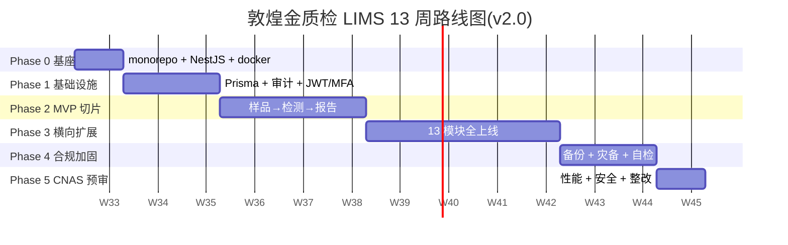

# 06 - 实施路线图(ROADMAP)

> **项目**: 敦煌金质检 LIMS(专家级)
> **业务**: 贵金属(黄金)检测 —— 火试金法 + ICP(详见 [ADR-0011](./adr/0011-precious-metal-business.md))
> **版本**: v2.0.0
> **日期**: 2026-08-04
> **维护者**: 天枢(架构师)
> **状态**: 🔄 已重写为 6 阶段 13 周(对比原 12 个月)

> ⚠️ **变更说明**:本版本已重写。原 12 个月路线图移入 [archive/06-ROADMAP-12months-original.md](./archive/06-ROADMAP-12months-original.md)。

---

## 1. 13 周总览

## 2. 关键里程碑

| 里程碑 | 周次 | 标志事件 | 业务价值 |
|---|---|---|---|
| **M1 基座就绪** | W1 | 全栈可启动 + CI 绿 | 团队进入开发状态 |
| **M2 鉴权闭环** | W3 | 登录 + 审计 + 追溯 | 合规基础 |
| **M3 MVP 切片** ⭐ | W6 | 样品→检测→报告端到端 | **可演示给客户/审核员** |
| **M4 功能完整** | W10 | 13 模块全上线 | 完整业务能力 |
| **M5 合规就绪** | W12 | 备份演练 + 自检通过 | CNAS 审核准备 |
| **M6 预审通过** ⭐ | W13 | 性能 + 安全 + 整改 | **CNAS 现场审核可申请** |

⭐ = 项目最关键的两个里程碑

## 3. 阶段交付物

| 阶段 | 周次 | 主题 | 详细手册 |
|---|---|---|---|
| **Phase 0** | W1 | 基座校准 | [PHASE-0-baseline.md](./migration/PHASE-0-baseline.md) |
| **Phase 1** | W2-3 | 基础设施 | [PHASE-1-infra.md](./migration/PHASE-1-infra.md) |
| **Phase 2** | W4-6 | 垂直切片 MVP | [PHASE-2-mvp-slice.md](./migration/PHASE-2-mvp-slice.md) |
| **Phase 3** | W7-10 | 横向扩展 | [PHASE-3-horizontal.md](./migration/PHASE-3-horizontal.md) |
| **Phase 4** | W11-12 | 合规加固 | [PHASE-4-compliance.md](./migration/PHASE-4-compliance.md) |
| **Phase 5** | W13 | CNAS 预审 | [PHASE-5-cnas-audit.md](./migration/PHASE-5-cnas-audit.md) |

完整执行计划:[EXECUTION-PLAN.md](./migration/EXECUTION-PLAN.md)

## 4. 阶段状态

| 阶段 | 状态 | 完成度 |
|---|---|---|
| Phase 0 | ⏳ 待启动 | 0% |
| Phase 1 | ⏳ 待启动 | 0% |
| Phase 2 | ⏳ 待启动 | 0% |
| Phase 3 | ⏳ 待启动 | 0% |
| Phase 4 | ⏳ 待启动 | 0% |
| Phase 5 | ⏳ 待启动 | 0% |

## 5. 与原 12 个月路线图的对比

| 维度 | 原 12 个月(v1) | 新 13 周(v2) | 改进 |
|---|---|---|---|
| **周期** | 12 个月 | 13 周 | -75% |
| **MVP 切片** | M9-M10(第 9-10 月) | W6(第 6 周) | -75% |
| **CNAS 预审** | M12(第 12 月) | W13(第 13 周) | -75% |
| **团队规模** | 8.5 人 | 5-6 人(含 AI) | -30% |
| **可演示节点** | M9 后才有可演示 | W6 即可演示 | 提前 9 个月 |

**为什么能缩短**:MVP 切片思路 + AI 加速(天枢全栈) + 业务收敛(只做黄金检测)。

## 6. 关键 ADR 索引

| ADR | 决策 |
|---|---|
| [ADR-0001](./adr/0001-monorepo-turborepo.md) | Monorepo + pnpm + Turborepo |
| [ADR-0002](./adr/0002-nestjs-prisma-pg.md) | NestJS + Prisma + PG16 + TimescaleDB |
| [ADR-0003](./adr/0003-audit-chain-pg-trigger.md) | 审计链 PG 触发器 |
| [ADR-0004](./adr/0004-ca-third-party.md) | 第三方 CA 服务 |
| [ADR-0005](./adr/0005-xstate-redundant-db.md) | XState + DB 字段冗余 |
| [ADR-0006](./adr/0006-pdf-puppeteer-minio.md) | Puppeteer + MinIO + 时间戳 |
| [ADR-0007](./adr/0007-mvp-slice-not-12months.md) | MVP 切片优先 |
| [ADR-0008](./adr/0008-local-k8s-kind-k3d.md) | kind/k3d 本地 K8s |
| [ADR-0009](./adr/0009-jwt-refresh-totp-self-hosted.md) | JWT + TOTP 自建认证 |
| [ADR-0010](./adr/0010-pwa-indexeddb-lww.md) | PWA 离线 + IndexedDB + LWW |
| [ADR-0011](./adr/0011-precious-metal-business.md) | 贵金属检测业务约束 |

## 7. 资源分配

| 角色 | 人数 | 主要阶段 |
|---|---|---|
| 菩提老祖(产品负责人) | 1 | 全程 |
| 天枢(架构师 + AI 全栈) | 1 | 全程 |
| 后端工程师 | 1-2 | P1-P5 |
| 前端工程师 | 1 | P0-P3 |
| DevOps | 0.5(兼职) | P0、P1、P4、P5 |
| CNAS 顾问 | 0.5(外部) | P4、P5 |
| **合计** | **5-6 人** | - |

## 8. 风险与缓解

| 风险 | 概率 | 影响 | 缓解 |
|---|---|---|---|
| Phase 2 MVP 延期 | 中 | 高 | 严格 WIP 限制,只做"样品→检测→报告"3 模块 |
| CA 证书集成复杂 | 中 | 高 | Phase 4 提前 POC |
| 数据迁移丢失 | 低 | 严重 | 双重备份 + 小批量分阶段 |
| 性能不达标 | 中 | 中 | Phase 5 压测,准备优化预案 |
| 团队学习曲线 | 中 | 中 | ADR + Code Review |
| 第三方依赖不可用 | 低 | 严重 | 备选供应商 |
| CNAS 审核不通过 | 中 | 严重 | 内部审核 + 外部顾问 |

## 9. 后续路线(M13+)

13 周后 LIMS 已具备 CNAS 现场审核能力。后续可规划:

- **M14-16 高级特性**:工作流引擎增强、移动端、PWA 离线、消息通知
- **M17-20 集成**:与 ERP / MES / 黄金交易所对接、API 开放平台
- **M21-24 AI 增强**:异常检测、QC 趋势预测、报告自动生成、智能客服
- **持续运营**:性能监控、用户反馈、迭代优化、新检测方法扩展

## 10. 附录

- [项目总览](./00-PROJECT-PLAN.md)
- [架构设计](./01-ARCHITECTURE.md)
- [数据库设计](./02-DATABASE.md)
- [API 规范](./03-API.md)
- [CNAS 合规](./04-CNAS-COMPLIANCE.md)
- [部署架构](./05-DEPLOYMENT.md)
- [13 周执行计划](./migration/EXECUTION-PLAN.md)
- [原 12 个月路线图归档](./archive/06-ROADMAP-12months-original.md)