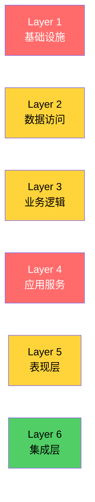
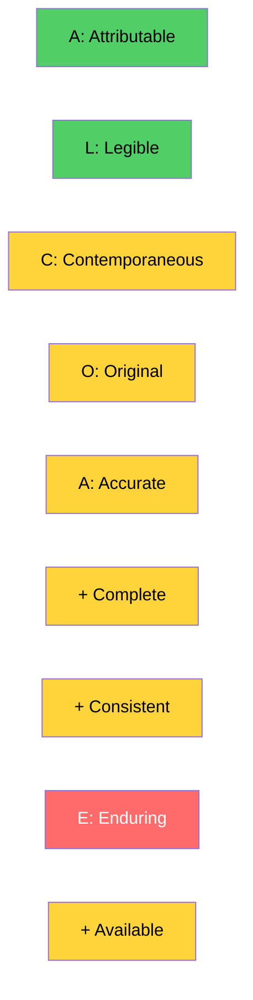
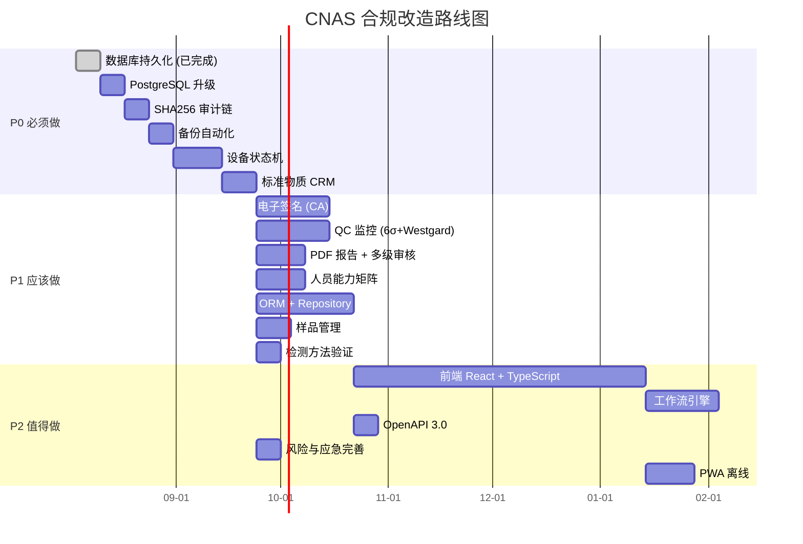
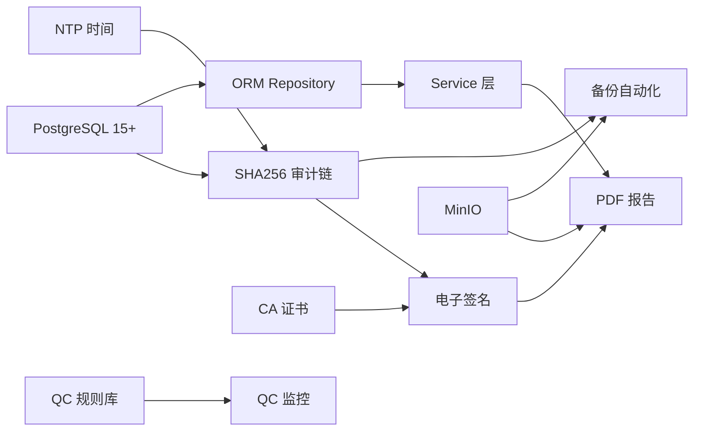

# D:\lab lims LIMS 系统 — CNAS 架构差异分析报告

> **分析日期**: 2026-08-03
> **分析对象**: D:\lab lims LIMS 系统（基于 Node.js + Express + better-sqlite3）
> **参考标准**: ISO/IEC 17025:2017 + CNAS-CL01:2018《检测和校准实验室能力认可准则》
> **文档目的**: 识别 D:\lab lims 与 CNAS 认可要求之间的差距，并给出可执行的改进方案
> **适用读者**: 实验室管理者 / 系统架构师 / CNAS 审核员 / 开发团队

---

## 一、执行摘要

### 1.1 当前成熟度总览

| 维度 | 当前评分 | CNAS 目标 | 差距 |
|---|---|---|---|
| **整体合规度** | 45% | 95% | -50% |
| **数据完整性（ALCOA+）** | 50% | 100% | -50% |
| **审计可追溯** | 30% | 100% | -70% |
| **质量控制（QC）** | 5% | 90% | -85% |
| **电子签名** | 0% | 95% | -95% |
| **备份与灾备** | 25% | 100% | -75% |
| **人员能力管理** | 40% | 100% | -60% |

### 1.2 严重项统计

| 严重度 | 数量 | 占比 | 含义 |
|---|---|---|---|
| 🔴 **严重** | 5 项 | 25% | 缺失会导致 CNAS 审核不通过 / 数据丢失 |
| 🟡 **中** | 11 项 | 55% | 缺失会导致部分条款不符合 |
| 🟢 **低** | 4 项 | 20% | 建议改进但不强制 |

### 1.3 改进总工期估算（**单人全职**）

| 阶段 | 工期 |
|---|---|
| **P0（必须做）** | 8-10 周 |
| **P1（应该做）** | 12-16 周 |
| **P2（值得做）** | 16-24 周 |
| **总计** | **36-50 周**（约 9-12 月） |

### 1.4 关键风险（**CNAS 审核必看**）

| 风险 | 后果 | 缓解 |
|---|---|---|
| sql.js 内存模式 → 数据易失 | 进程崩溃数据全失 | **立即**升级 better-sqlite3（已完成）→ PostgreSQL |
| 审计日志无 hash chain | 篡改无法检测 | P0: 实现 SHA256 append-only 链 |
| 无电子签名 | 报告法律效力不足 | P0: 集成 CA 证书签名 |
| 无 QC 监控 | 检测结果有效性存疑 | P0: 实现 6σ + Westgard 规则 |
| 备份手动 | 灾难恢复困难 | P0: 自动 cron + 异地备份 |

---

## 二、6 层架构对比

### 2.1 整体架构图

```mermaid
graph TB
    subgraph "当前架构（不达 CNAS）"
        A1[浏览器<br/>原生JS+Bootstrap 3] --> A2[Express 路由<br/>13个 routes]
        A2 --> A3[业务逻辑<br/>路由内联]
        A3 --> A4[sql.js<br/>内存SQLite]
        A4 --> A5[文件<br/>.data 复制]
    end

    subgraph "CNAS 目标架构"
        B1[浏览器<br/>React+TS+PWA] --> B2[API Gateway<br/>OpenAPI 3.0]
        B2 --> B3[应用服务层<br/>编排+PDF+签名]
        B3 --> B4[业务逻辑层<br/>Service+State Machine]
        B4 --> B5[数据访问层<br/>Repository+ORM]
        B5 --> B6[PostgreSQL 15<br/>+Redis+MinIO+InfluxDB]
        B6 --> B7[异地灾备<br/>S3兼容]
    end
```



### 2.2 Layer 1: 基础设施层

| 子项 | 当前实现 | CNAS 标准 | Gap 严重度 | 工作量 |
|---|---|---|---|---|
| **主数据库** | sql.js（内存）| PostgreSQL 15+ | 🔴 严重 | 2 周 |
| **缓存** | 无 | Redis 7 | 🟡 中 | 1 周 |
| **文件存储** | 本地 lims_uploads/ | MinIO（S3 兼容）| 🟡 中 | 1 周 |
| **时序数据** | 混在 SQLite | InfluxDB | 🟡 中 | 1 周 |
| **消息队列** | 无 | RabbitMQ | 🟢 低 | 1 周 |
| **异地灾备** | 无 | 异地 S3 同步 | 🔴 严重 | 1 周 |
| **HTTPS/WSS** | 仅 HTTP | TLS 1.3 强制 | 🟡 中 | 0.5 周 |
| **密钥管理** | .env 文件 | HashiCorp Vault | 🟡 中 | 1 周 |

**L1 综合**: 🔴 严重，需要 8 周集中改造

### 2.3 Layer 2: 数据访问层

| 子项 | 当前实现 | CNAS 标准 | Gap | 工作量 |
|---|---|---|---|---|
| **ORM** | 直调 db.prepare | Prisma / TypeORM | 🟡 中 | 2 周 |
| **Repository 模式** | 无 | 实体 Repository | 🟡 中 | 2 周 |
| **数据库迁移** | runMigrations | Flyway / Liquibase | 🟡 中 | 1 周 |
| **审计写入器** | makeAudit | SHA256 hash chain | 🔴 严重 | 1 周 |
| **连接池** | 单连接 | pg.Pool | 🟢 低 | 0.5 周 |
| **事务管理** | 无显式 | Unit of Work | 🟡 中 | 1 周 |

**L2 综合**: 🟡 中等，需要 7.5 周

### 2.4 Layer 3: 业务逻辑层

| 子项 | 当前实现 | CNAS 标准 | Gap | 工作量 |
|---|---|---|---|---|
| **领域服务** | 路由内联 | Service 类 | 🟡 中 | 3 周 |
| **状态机** | 字符串 status | 显式 State Machine | 🟡 中 | 2 周 |
| **工作流引擎** | 无 | Flowable / Camunda | 🟡 中 | 3 周 |
| **业务规则引擎** | if/else | Drools | 🟢 低 | 2 周 |
| **领域事件** | 无 | EventBus | 🟢 低 | 2 周 |

**L3 综合**: 🟡 中等，需要 12 周

### 2.5 Layer 4: 应用服务层

| 子项 | 当前实现 | CNAS 标准 | Gap | 工作量 |
|---|---|---|---|---|
| **用例编排** | 路由内 | ApplicationService | 🟡 中 | 2 周 |
| **PDF 报告** | 表 | Puppeteer + 模板 | 🟡 中 | 2 周 |
| **电子签名（CA）** | 无 | CFCA / BJCA | 🔴 严重 | 3 周 |
| **通知系统** | 无 | 邮件/短信 | 🟢 低 | 1 周 |
| **定时任务** | 无 | node-cron | 🟡 中 | 1 周 |
| **趋势分析** | 无 | 6σ + Westgard | 🔴 严重 | 3 周 |

**L4 综合**: 🔴 严重，需要 13 周

### 2.6 Layer 5: 表现层

| 子项 | 当前实现 | CNAS 标准 | Gap | 工作量 |
|---|---|---|---|---|
| **技术栈** | 原生 JS + Bootstrap 3 | React 18 + TypeScript | 🟡 中 | 6 周 |
| **构建工具** | 无 | Vite | 🟡 中 | 1 周 |
| **状态管理** | 直接 DOM | Zustand | 🟡 中 | 2 周 |
| **UI 组件库** | Bootstrap 3 | Ant Design 5 | 🟡 中 | 2 周 |
| **图表** | 自绘 Canvas | ECharts | 🟡 中 | 1 周 |
| **PWA 离线** | 无 | Service Worker | 🟢 低 | 2 周 |
| **无障碍 a11y** | 无 | WCAG 2.1 | 🟢 低 | 1 周 |
| **移动端** | 桌面优先 | React Native | 🟢 低 | 4 周 |

**L5 综合**: 🟡 中等，需要 19 周

### 2.7 Layer 6: 集成层

| 子项 | 当前实现 | CNAS 标准 | Gap | 工作量 |
|---|---|---|---|---|
| **REST API** | 13 routes | OpenAPI 3.0 | 🟢 低 | 1 周 |
| **WebHook** | 无 | 事件推送 | 🟢 低 | 1 周 |
| **省级平台对接** | 无 | 国标上报格式 | 🟡 中 | 2 周 |
| **ERP/MES 对接** | 无 | REST | 🟢 低 | 2 周 |

**L6 综合**: 🟢 低，6 周

### 2.8 6 层综合评估



**结论**: **L1 和 L4 有严重 Gap**，是 P0 优先；其他层为 P1/P2。

---

## 三、CNAS 横向模块详细分析

### 3.1 模块严重度总览

```mermaid
graph TB
    M1[3.1 审计追踪<br/>SHA256链]:::severe
    M2[3.2 电子签名<br/>CA证书]:::severe
    M3[3.3 QC质控<br/>6σ+Westgard]:::severe
    M4[3.4 备份恢复<br/>异地灾备]:::severe
    M5[3.5 人员培训]:::medium
    M6[3.6 设备生命周期]:::medium
    M7[3.7 标准物质]:::medium
    M8[3.8 样品管理]:::medium
    M9[3.9 检测方法]:::medium
    M10[3.10 报告PDF]:::medium
    M11[3.11 风险应急]:::low

    classDef severe fill:#ff6b6b,color:#fff
    classDef medium fill:#ffd43b,color:#000
    classDef low fill:#51cf66,color:#000
```



### 3.2 模块 1：审计追踪（🔴 严重）

**CNAS 条款**: ISO 17025 §7.5 技术记录, §7.11.2 数据控制
**ALCOA+ 要求**: Original + Complete + Enduring

#### 当前实现
- 表 `audit_logs` 存在，记录 user_id/table_name/record_id/old_data/new_data/ip_address
- **问题**: 无 hash chain，可被修改/删除；append-only 未强制

#### 目标实现
- **SHA256 hash chain**：每条 audit_log 含 `prev_hash` 和 `curr_hash = SHA256(prev_hash + JSON.stringify(record))`
- 校验工具：可独立检测 hash 链断裂
- append-only：DB 触发器阻止 UPDATE/DELETE
- 不可绕过的写入：所有 ORM 操作自动触发

#### 代码示例

```javascript
// 文件: lib/audit-chain.js
const crypto = require('crypto');

class AuditChain {
  constructor(db) {
    this.db = db;
  }

  /**
   * 写入一条审计日志，自动计算 hash
   */
  append(entry) {
    const lastEntry = this.db.prepare(
      'SELECT curr_hash FROM audit_logs ORDER BY id DESC LIMIT 1'
    ).get();
    const prevHash = lastEntry ? lastEntry.curr_hash : '0'.repeat(64);

    const data = JSON.stringify({
      ts: new Date().toISOString(),
      user_id: entry.user_id,
      action: entry.action,
      table_name: entry.table_name,
      record_id: entry.record_id,
      old_data: entry.old_data,
      new_data: entry.new_data
    });
    const currHash = crypto
      .createHash('sha256')
      .update(prevHash + data)
      .digest('hex');

    const info = this.db.prepare(`
      INSERT INTO audit_logs
        (user_id, action, table_name, record_id, old_data, new_data, ip_address, prev_hash, curr_hash, created_at)
      VALUES (?, ?, ?, ?, ?, ?, ?, ?, ?, datetime('now'))
    `).run(
      entry.user_id, entry.action, entry.table_name, entry.record_id,
      JSON.stringify(entry.old_data), JSON.stringify(entry.new_data),
      entry.ip_address, prevHash, currHash
    );

    return { id: info.lastInsertRowid, curr_hash: currHash };
  }

  /**
   * 校验 hash chain 完整性
   */
  verify() {
    const rows = this.db.prepare(
      'SELECT id, prev_hash, curr_hash, created_at, user_id, action, table_name, record_id, old_data, new_data FROM audit_logs ORDER BY id ASC'
    ).all();

    let expectedPrev = '0'.repeat(64);
    for (const row of rows) {
      if (row.prev_hash !== expectedPrev) {
        return { valid: false, brokenAt: row.id };
      }
      const data = JSON.stringify({
        ts: row.created_at,
        user_id: row.user_id,
        action: row.action,
        table_name: row.table_name,
        record_id: row.record_id,
        old_data: JSON.parse(row.old_data),
        new_data: JSON.parse(row.new_data)
      });
      const recalculated = crypto
        .createHash('sha256')
        .update(row.prev_hash + data)
        .digest('hex');
      if (recalculated !== row.curr_hash) {
        return { valid: false, brokenAt: row.id };
      }
      expectedPrev = row.curr_hash;
    }
    return { valid: true, brokenAt: null };
  }
}

module.exports = AuditChain;
```

```sql
-- 阻止 UPDATE/DELETE 的触发器
CREATE TRIGGER audit_logs_no_update
BEFORE UPDATE ON audit_logs
BEGIN
  SELECT RAISE(ABORT, 'audit_logs is append-only');
END;

CREATE TRIGGER audit_logs_no_delete
BEFORE DELETE ON audit_logs
BEGIN
  SELECT RAISE(ABORT, 'audit_logs is append-only');
END;
```

#### 验收标准
- 每次 INSERT 自动计算 SHA256 hash
- 验证脚本可检测 hash 链断裂
- 直接 SQL UPDATE/DELETE 被 DB 拒绝
- 迁移现有 audit_logs（计算历史 hash）

**工作量**: 1 周
**风险**: 低

---

### 3.3 模块 2：电子签名（🔴 严重）

**CNAS 条款**: ISO 17025 §7.8.2 报告意见与解释
**法律依据**: 《电子签名法》第十三条 + 《电子认证服务管理办法》

#### 当前实现
- 无电子签名：报告仅以 user_id 字符串表示"谁批的"

#### 目标实现
- **多级审核链**：检测人 → 校核人 → 审核人 → 批准人
- **CA 证书签名**：使用 SM2/SM3 国密算法（中国标准）或 RSA/ECDSA（国际）
- **时间戳**：对接国家授时中心 TSA 服务
- **签名验证**：PDF 嵌入签名，Adobe Reader / 福昕 可验

#### 代码示例

```javascript
// 文件: lib/e-signature.js
const crypto = require('crypto');
const forge = require('node-forge');

class ESignature {
  /**
   * 用 CA 证书签名报告
   */
  async signReport(params) {
    const { reportId, content, signerCert, signerKey, tsaUrl } = params;

    // 1. 计算报告 hash
    const reportHash = crypto
      .createHash('sha256')
      .update(content)
      .digest('hex');

    // 2. 向 TSA 申请时间戳
    const timestamp = await this.requestTimestamp(reportHash, tsaUrl);

    // 3. 用签名者私钥签名
    const signData = reportHash + '|' + timestamp + '|' + reportId;
    const signature = crypto.sign('RSA-SHA256', Buffer.from(signData), signerKey);

    // 4. 记录到数据库
    this.db.prepare(`
      INSERT INTO report_signatures
        (report_id, signer_cert, cert_serial, signature, timestamp_token, hash, signed_at)
      VALUES (?, ?, ?, ?, ?, ?, datetime('now'))
    `).run(reportId, signerCert, 'CERT-SERIAL-001', signature, timestamp, reportHash);

    return { signature, certSerial: 'CERT-SERIAL-001', timestamp, hash: reportHash };
  }

  async requestTimestamp(hash, tsaUrl) {
    // 对接国家授时中心 TSA
    const response = await fetch(tsaUrl, {
      method: 'POST',
      body: JSON.stringify({ hash }),
      headers: { 'Content-Type': 'application/json' }
    });
    return await response.text();
  }

  verify(reportId, content, signature, cert) {
    const reportHash = crypto.createHash('sha256').update(content).digest('hex');
    return crypto.verify('RSA-SHA256', Buffer.from(content), cert, signature);
  }
}

module.exports = ESignature;
```

```sql
CREATE TABLE report_signatures (
  id INTEGER PRIMARY KEY AUTOINCREMENT,
  report_id INTEGER NOT NULL,
  signer_user_id INTEGER NOT NULL,
  signer_cert TEXT NOT NULL,
  cert_serial TEXT NOT NULL,
  signature BLOB NOT NULL,
  timestamp_token BLOB NOT NULL,
  hash TEXT NOT NULL,
  signed_at TEXT DEFAULT (datetime('now')),
  FOREIGN KEY (report_id) REFERENCES experimental_data_reports(id),
  FOREIGN KEY (signer_user_id) REFERENCES users(id)
);

-- 签名阶段（多级审核）
CREATE TABLE report_sign_stages (
  id INTEGER PRIMARY KEY AUTOINCREMENT,
  report_id INTEGER NOT NULL,
  stage TEXT NOT NULL,  -- 'tester' | 'reviewer' | 'auditor' | 'approver'
  user_id INTEGER NOT NULL,
  signed_at TEXT,
  FOREIGN KEY (report_id) REFERENCES experimental_data_reports(id)
);
```

#### 验收标准
- PDF 报告嵌入 CA 证书签名
- Adobe Reader / 福昕 PDF Reader 可验证签名有效性
- 多级审核链：必须 4 人都签才能发布
- 时间戳来自权威 TSA

**工作量**: 3 周
**风险**: 中

---

### 3.4 模块 3：QC 质控（🔴 严重）

**CNAS 条款**: ISO 17025 §7.7 结果有效性
**核心要求**: 内部质量控制（IQC）+ 外部质量控制（EQC）

#### 当前实现
- 完全缺失：无质控数据收集 / 趋势图 / 失控规则

#### 目标实现
- **4 类质控样**：
  - 空白（method blank）
  - 平行样（duplicate）
  - 加标回收（spike recovery，80-120% 合格）
  - 质控样（QC sample，已知值）
- **6σ 趋势图**（Levey-Jennings chart）
- **Westgard 规则**：
  - 1₃s：1 个点超出 ±3σ → 警告
  - 2₂s：连续 2 个点超出同侧 ±2σ → 失控
  - R₄s：连续 2 个点差值 >4σ → 失控
  - 4₁s：连续 4 个点超出同侧 ±1σ → 失控
  - 10x̄：连续 10 个点在均值同一侧 → 趋势

#### 代码示例

```javascript
// 文件: lib/qc-monitor.js
class QCMonitor {
  /**
   * Westgard 多规则评估
   */
  evaluate(data) {
    const m = data.measurements;
    const mean = m.reduce((a, b) => a + b, 0) / m.length;
    const std = Math.sqrt(m.reduce((a, b) => a + (b - mean) ** 2, 0) / (m.length - 1));

    const violations = [];

    // 1₃s: 1 个点超出 ±3σ
    if (m.some(x => Math.abs(x - mean) > 3 * std)) {
      violations.push('1_3s');
    }

    // 2₂s: 连续 2 个点超出同侧 ±2σ
    let count = 0, lastSide = 0;
    for (const x of m) {
      const side = x > mean ? 1 : -1;
      const beyond = Math.abs(x - mean) > 2 * std;
      if (beyond && side === lastSide) count++;
      else { count = beyond ? 1 : 0; lastSide = side; }
      if (count >= 2) { violations.push('2_2s'); break; }
    }

    // R₄s: 连续 2 个点差值 >4σ
    for (let i = 1; i < m.length; i++) {
      if (Math.abs(m[i] - m[i - 1]) > 4 * std) {
        violations.push('R_4s');
        break;
      }
    }

    // 4₁s: 连续 4 个点超出同侧 ±1σ
    let consec = 0, side = 0;
    for (const x of m) {
      const s = x > mean ? 1 : -1;
      const beyond = Math.abs(x - mean) > std;
      if (beyond && s === side) consec++;
      else { consec = beyond ? 1 : 0; side = s; }
      if (consec >= 4) { violations.push('4_1s'); break; }
    }

    // 10x̄: 连续 10 个点在均值同一侧
    if (m.length >= 10) {
      const last10 = m.slice(-10);
      if (last10.every(x => x > mean) || last10.every(x => x < mean)) {
        violations.push('10x');
      }
    }

    let status = 'in-control';
    if (violations.some(v => ['1_3s', '2_2s', 'R_4s', '4_1s'].includes(v))) {
      status = 'out-of-control';
    } else if (violations.length > 0) {
      status = 'warning';
    }

    return { ruleViolations: violations, status, mean, std };
  }
}
```

```sql
CREATE TABLE qc_samples (
  id INTEGER PRIMARY KEY AUTOINCREMENT,
  qc_no TEXT UNIQUE NOT NULL,
  project_id INTEGER NOT NULL,
  analyte TEXT NOT NULL,
  expected_value REAL,
  expected_sd REAL,
  unit TEXT,
  lot_no TEXT,
  valid_date TEXT,
  created_at TEXT DEFAULT (datetime('now')),
  FOREIGN KEY (project_id) REFERENCES projects(id)
);

CREATE TABLE qc_measurements (
  id INTEGER PRIMARY KEY AUTOINCREMENT,
  qc_id INTEGER NOT NULL,
  measurement_date TEXT NOT NULL,
  measured_value REAL NOT NULL,
  operator_id INTEGER,
  equipment_id INTEGER,
  rule_violations TEXT,
  status TEXT,
  remark TEXT,
  created_at TEXT DEFAULT (datetime('now')),
  FOREIGN KEY (qc_id) REFERENCES qc_samples(id)
);

CREATE VIEW v_qc_trend AS
SELECT
  qc.id, qc.qc_no, qc.analyte,
  m.measurement_date, m.measured_value,
  qc.expected_value AS mean, qc.expected_sd AS sd,
  (m.measured_value - qc.expected_value) / qc.expected_sd AS z_score
FROM qc_samples qc
JOIN qc_measurements m ON qc.id = m.qc_id
ORDER BY m.measurement_date;
```

#### 验收标准
- 每次检测自动记录 QC 测量值
- 自动评估 Westgard 规则
- 失控时阻止报告发布
- 6σ 趋势图实时显示

**工作量**: 3 周
**风险**: 中

---

### 3.5 模块 4：备份与恢复（🔴 严重）

**CNAS 条款**: ISO 17025 §7.11.2 数据控制

#### 当前实现
- 手动 `cp .data`，无自动化
- 无异地备份
- 无恢复演练记录

#### 目标实现
- 每日全量 + 实时增量（WAL 模式）
- 3-2-1 策略：3 份副本，2 种介质，1 份异地
- 异地 S3 同步：MinIO + aws-sdk
- 每月恢复演练
- 加密备份：AES-256-GCM

#### 代码示例

```javascript
// 文件: scripts/backup.js
const { spawn } = require('child_process');
const fs = require('fs');
const path = require('path');
const crypto = require('crypto');
const { S3Client, PutObjectCommand } = require('@aws-sdk/client-s3');
const schedule = require('node-schedule');

class BackupService {
  constructor(config) {
    this.config = config;
    this.s3 = new S3Client({
      endpoint: config.s3Endpoint,
      region: 'us-east-1',
      credentials: {
        accessKeyId: config.s3AccessKey,
        secretAccessKey: config.s3SecretKey
      }
    });
  }

  /**
   * 每日全量备份（02:00 执行）
   */
  async dailyFullBackup() {
    const timestamp = new Date().toISOString().slice(0, 10);
    const filename = `lims-full-${timestamp}.sql.gz.enc`;
    const localPath = path.join(this.config.backupDir, filename);

    // 1. 导出数据库
    const sqlDump = await this.dumpPostgres();
    const compressed = require('zlib').gzipSync(sqlDump);

    // 2. 加密（AES-256-GCM）
    const key = crypto.scryptSync(this.config.encryptionKey, 'salt', 32);
    const iv = crypto.randomBytes(16);
    const cipher = crypto.createCipheriv('aes-256-gcm', key, iv);
    const encrypted = Buffer.concat([cipher.update(compressed), cipher.final()]);
    const authTag = cipher.getAuthTag();

    const final = Buffer.concat([iv, authTag, encrypted]);
    fs.writeFileSync(localPath, final);

    // 3. 上传到异地 S3
    await this.s3.send(new PutObjectCommand({
      Bucket: this.config.s3Bucket,
      Key: `backups/${filename}`,
      Body: final
    }));

    // 4. 清理 30 天前的本地备份
    this.cleanOldBackups(30);

    console.log(`[BACKUP] ${filename} uploaded, size=${final.length}B`);
  }

  cleanOldBackups(days) {
    const cutoff = Date.now() - days * 86400 * 1000;
    for (const f of fs.readdirSync(this.config.backupDir)) {
      const stat = fs.statSync(path.join(this.config.backupDir, f));
      if (stat.mtimeMs < cutoff) fs.unlinkSync(path.join(this.config.backupDir, f));
    }
  }

  /**
   * 每月恢复演练
   */
  async monthlyRestoreDrill() {
    const testDbName = `lims_restore_test_${Date.now()}`;
    try {
      const latest = this.getLatestBackup();
      const decrypted = this.decrypt(latest);

      await this.restoreToDb(decrypted, testDbName);

      const checks = await this.verifyRestoredData(testDbName);
      const auditValid = await this.verifyHashChain(testDbName);

      this.generateDrillReport(checks, auditValid);
      await this.dropTestDb(testDbName);
    } catch (e) {
      console.error('[BACKUP DRILL] FAILED:', e);
      this.alertOncall('backup-drill-failed', e);
    }
  }
}

// 注册定时任务
const backup = new BackupService(config);
schedule.scheduleJob('0 2 * * *', () => backup.dailyFullBackup());
schedule.scheduleJob('0 3 1 * *', () => backup.monthlyRestoreDrill());
```

#### 验收标准
- 每日 02:00 自动备份
- 加密后上传到异地 S3
- 30 天保留期
- 每月 1 日自动恢复演练
- 演练报告自动生成

**工作量**: 1 周
**风险**: 中

---

### 3.6 模块 5：人员培训 + 能力矩阵（🟡 中）

**CNAS 条款**: ISO 17025 §6.2 人员

#### 当前实现
- `users` 表 + `training_records` 表
- 缺：能力评估、监督记录、人员-项目授权矩阵

#### 目标实现
- 培训年度计划（已有）
- 培训记录（已部分）
- 能力评估表：每年一次笔试 + 实操
- 监督记录：资深人员监督新人
- 人员-项目授权矩阵：user × project 二维表

#### 代码示例

```sql
CREATE TABLE user_competency (
  id INTEGER PRIMARY KEY AUTOINCREMENT,
  user_id INTEGER NOT NULL,
  project_id INTEGER NOT NULL,
  competency_level TEXT NOT NULL,
  authorized_at TEXT,
  authorized_by INTEGER,
  valid_until TEXT,
  assessment_id INTEGER,
  status TEXT DEFAULT 'active',
  FOREIGN KEY (user_id) REFERENCES users(id),
  FOREIGN KEY (project_id) REFERENCES projects(id)
);

CREATE TABLE competency_assessments (
  id INTEGER PRIMARY KEY AUTOINCREMENT,
  user_id INTEGER NOT NULL,
  project_id INTEGER NOT NULL,
  assessment_date TEXT NOT NULL,
  assessor_id INTEGER NOT NULL,
  written_score REAL,
  practical_score REAL,
  result TEXT,
  remarks TEXT,
  FOREIGN KEY (user_id) REFERENCES users(id),
  FOREIGN KEY (project_id) REFERENCES projects(id),
  FOREIGN KEY (assessor_id) REFERENCES users(id)
);

CREATE TABLE supervision_records (
  id INTEGER PRIMARY KEY AUTOINCREMENT,
  trainee_id INTEGER NOT NULL,
  supervisor_id INTEGER NOT NULL,
  project_id INTEGER NOT NULL,
  supervision_date TEXT NOT NULL,
  duration_hours REAL,
  result TEXT,
  remarks TEXT,
  FOREIGN KEY (trainee_id) REFERENCES users(id),
  FOREIGN KEY (supervisor_id) REFERENCES users(id),
  FOREIGN KEY (project_id) REFERENCES projects(id)
);

CREATE VIEW v_user_competency_matrix AS
SELECT
  u.id AS user_id, u.name, u.dept, u.title,
  p.id AS project_id, p.project_name, p.method_type,
  uc.competency_level, uc.authorized_at, uc.valid_until, uc.status
FROM users u
CROSS JOIN projects p
LEFT JOIN user_competency uc ON u.id = uc.user_id AND p.id = uc.project_id;
```

#### 验收标准
- 能力矩阵视图
- 授权过期前 30 天自动提醒
- 未授权人员分配检测任务时系统拦截
- 监督记录 + 评估记录完整

**工作量**: 2 周
**风险**: 低

---

### 3.7 模块 6：设备全生命周期（🟡 中）

**CNAS 条款**: ISO 17025 §6.4 设备

#### 当前实现
- `equipment` 表 + `equipment_maintenance` + `equipment_calibration` + `equipment_repairs`
- 缺：设备状态机、期间核查、唯一性标识

#### 目标实现
- 设备状态机：`procurement` → `acceptance` → `qualified` → `in-use` → `maintenance` → `retired`
- 期间核查：两次校准之间定期核查
- 唯一编号：每台设备唯一 ID + 物理标签

#### 代码示例

```javascript
// 文件: lib/equipment-state-machine.js
const { Machine, interpret } = require('xstate');

const equipmentMachine = Machine({
  id: 'equipment',
  initial: 'procurement',
  states: {
    procurement: { on: { ACCEPT: 'acceptance' } },
    acceptance: {
      on: { QUALIFY: 'qualified', REJECT: 'retired' }
    },
    qualified: {
      on: { DEPLOY: 'in-use', RETIRE: 'retired' }
    },
    'in-use': {
      on: {
        NEED_MAINTENANCE: 'maintenance',
        OUT_OF_ORDER: 'broken',
        RETIRE: 'retired'
      }
    },
    maintenance: {
      on: { REPAIR_COMPLETE: 'in-use', RETIRE: 'retired' }
    },
    broken: {
      on: { REPAIR_COMPLETE: 'maintenance', RETIRE: 'retired' }
    },
    retired: { type: 'final' }
  }
});

class EquipmentService {
  async transition(equipmentId, event, userId) {
    const eq = this.db.prepare('SELECT status FROM equipment WHERE id = ?').get(equipmentId);
    if (!eq) throw new Error('设备不存在');

    const result = interpret(equipmentMachine).start(eq.status);
    result.send(event);
    if (result.changed) {
      this.db.prepare('UPDATE equipment SET status = ? WHERE id = ?')
        .run(result.value, equipmentId);

      this.auditChain.append({
        user_id: userId,
        action: 'state_transition',
        table_name: 'equipment',
        record_id: equipmentId,
        old_data: { status: eq.status },
        new_data: { status: result.value, event }
      });
    }
    return result.value;
  }
}
```

#### 验收标准
- 设备状态变更走状态机
- 校准到期前 30 天提醒
- 期间核查计划 + 记录
- 设备状态变更自动审计

**工作量**: 2 周
**风险**: 低

---

### 3.8 模块 7：标准物质 CRM（🟡 中）

**CNAS 条款**: ISO 17025 §6.5 计量溯源

#### 当前实现
- `reagent` 表（含标准品）+ `reagent_inbound` + `standard_substances` 表
- 部分覆盖

#### 目标实现
- CRM 证书编号（如 GBW 08645）
- 证书附件（PDF/图片，MinIO 存储）
- 不确定度（U, k=2）
- 有效期前 30 天自动失效

#### 代码示例

```sql
CREATE TABLE standard_certificates (
  id INTEGER PRIMARY KEY AUTOINCREMENT,
  certificate_no TEXT UNIQUE NOT NULL,
  substance_id INTEGER NOT NULL,
  issuer TEXT,
  concentration TEXT,
  uncertainty TEXT,
  valid_date TEXT NOT NULL,
  file_path TEXT,
  created_at TEXT DEFAULT (datetime('now')),
  FOREIGN KEY (substance_id) REFERENCES standard_substances(id)
);

ALTER TABLE standard_substances ADD COLUMN valid_date TEXT;
ALTER TABLE standard_substances ADD COLUMN alert_days INTEGER DEFAULT 30;

-- 触发器：到期前 30 天自动发提醒
CREATE TRIGGER trg_standard_expire_alert
AFTER UPDATE OF valid_date ON standard_substances
WHEN NEW.valid_date < date('now', '+30 days')
BEGIN
  INSERT INTO notifications (type, ref_id, message, created_at)
  VALUES ('standard_expiring', NEW.id,
    '标准物质 ' || NEW.substance_name || ' 即将过期', datetime('now'));
END;
```

#### 验收标准
- CRM 证书附件存储到 MinIO
- 有效期前 30 天自动提醒
- 过期标准物质不可用于检测

**工作量**: 1.5 周
**风险**: 低

---

### 3.9 模块 8：样品管理（🟡 中）

**CNAS 条款**: ISO 17025 §7.4 抽样 + §7.5 记录

#### 当前实现
- `samples` + `sample_appointments` + `sample_processing`
- 缺：唯一编号规则、留样、存储条件监控

#### 目标实现
- 唯一编号规则：YYYYMMDD-XXX
- 留样管理：留存期 + 处置
- 存储条件监控：温湿度超限报警

#### 代码示例

```sql
CREATE TABLE sample_storage (
  id INTEGER PRIMARY KEY AUTOINCREMENT,
  sample_id INTEGER UNIQUE NOT NULL,
  location TEXT,
  temperature REAL,
  humidity REAL,
  retention_until TEXT,
  photo_path TEXT,
  disposed_at TEXT,
  disposal_method TEXT,
  FOREIGN KEY (sample_id) REFERENCES samples(id)
);

CREATE TABLE storage_conditions (
  id INTEGER PRIMARY KEY AUTOINCREMENT,
  location TEXT NOT NULL,
  recorded_at TEXT NOT NULL,
  temperature REAL,
  humidity REAL,
  operator_id INTEGER
);

-- 触发器：温湿度超限报警
CREATE TRIGGER trg_storage_alert
AFTER INSERT ON storage_conditions
WHEN NEW.temperature > 25 OR NEW.temperature < 2 OR NEW.humidity > 60
BEGIN
  INSERT INTO notifications (type, ref_id, message, created_at)
  VALUES ('storage_alert', NEW.id,
    '存储位置 ' || NEW.location || ' 温湿度超限',
    datetime('now'));
END;
```

#### 验收标准
- 唯一编号自动生成（YYYYMMDD-NNN）
- 留样到期前 7 天提醒
- 温湿度超限自动报警

**工作量**: 1.5 周
**风险**: 低

---

### 3.10 模块 9：检测方法验证（🟡 中）

**CNAS 条款**: ISO 17025 §7.2 选定、验证和确认方法

#### 当前实现
- `projects` 表有 method_type 字段
- 缺：检出限、测定下限、不确定度、方法验证记录

#### 目标实现
- 方法参数表：检出限（LOD）、测定下限（LOQ）、线性范围、不确定度
- 方法验证记录：精密度、准确度、线性范围、特异性
- 非标方法确认

#### 代码示例

```sql
CREATE TABLE method_validations (
  id INTEGER PRIMARY KEY AUTOINCREMENT,
  project_id INTEGER NOT NULL,
  validation_type TEXT NOT NULL,
  lod REAL,
  loq REAL,
  linear_range_low REAL,
  linear_range_high REAL,
  r2_coefficient REAL,
  repeatability_rsd REAL,
  reproducibility_rsd REAL,
  recovery_pct REAL,
  uncertainty TEXT,
  is_standard_method INTEGER,
  standard_reference TEXT,
  validated_at TEXT,
  validated_by INTEGER,
  document_path TEXT,
  FOREIGN KEY (project_id) REFERENCES projects(id),
  FOREIGN KEY (validated_by) REFERENCES users(id)
);
```

#### 验收标准
- 每检测方法含 LOD/LOQ/不确定度
- 非标方法显式标识
- 验证报告可下载

**工作量**: 1 周
**风险**: 低

---

### 3.11 模块 10：报告 PDF + 多级审核（🟡 中）

**CNAS 条款**: ISO 17025 §7.8 报告结果

#### 当前实现
- `experimental_data_reports` 表
- 缺：PDF 渲染、多级审核链、电子签名

#### 目标实现
- PDF 模板：puppeteer + 实验室定制模板
- 多级审核链：4 级（检测 → 校核 → 审核 → 批准）
- 电子签名嵌入：CA 证书 + 时间戳

#### 代码示例

```javascript
// 文件: lib/report-generator.js
const puppeteer = require('puppeteer');
const handlebars = require('handlebars');

class ReportGenerator {
  async generatePDF(reportId) {
    const report = this.db.prepare(`
      SELECT r.*, s.sample_name, s.sample_type, p.project_name, p.method_type,
        u1.name AS analyst_name, u2.name AS reviewer_name, u3.name AS approver_name
      FROM experimental_data_reports r
      JOIN samples s ON r.sample_id = s.id
      JOIN projects p ON r.project_id = p.id
      LEFT JOIN users u1 ON r.analyst_id = u1.id
      LEFT JOIN users u2 ON r.supervisor_id = u2.id
      LEFT JOIN users u3 ON r.approver_id = u3.id
      WHERE r.id = ?
    `).get(reportId);

    // 1. 加载 HTML 模板
    const template = fs.readFileSync('./templates/report.hbs', 'utf-8');
    const html = handlebars.compile(template)(report);

    // 2. 用 puppeteer 渲染 PDF
    const browser = await puppeteer.launch();
    const page = await browser.newPage();
    await page.setContent(html, { waitUntil: 'networkidle0' });
    const pdfBuffer = await page.pdf({
      format: 'A4',
      printBackground: true,
      margin: { top: '20mm', bottom: '20mm', left: '15mm', right: '15mm' }
    });
    await browser.close();

    // 3. 嵌入电子签名
    const eSig = new ESignature();
    const signedPdf = await eSig.signReport({
      reportId, content: pdfBuffer,
      signerCert: process.env.APPROVER_CERT,
      signerKey: process.env.APPROVER_KEY,
      tsaUrl: process.env.TSA_URL
    });

    // 4. 存储到 MinIO
    await this.minio.putObject('reports', `r${reportId}.pdf`, signedPdf);

    return signedPdf;
  }
}
```

#### 验收标准
- PDF 模板符合 CNAS 报告要求
- 多级审核链：必须 4 人都签才能发布
- PDF 含 CA 签名 + 时间戳
- 报告修订有历史记录

**工作量**: 2 周
**风险**: 中

---

### 3.12 模块 11：风险与应急（🟢 已有）

**CNAS 条款**: ISO 17025 §8.5 风险措施

#### 当前实现
- ehs_hazard 表 + ehs_inspection 表 + ehs_incident 表
- 已有隐患管理基本功能

#### 缺失
- 应急演练记录
- 风险评估矩阵

#### 改进代码

```sql
CREATE TABLE risk_assessments (
  id INTEGER PRIMARY KEY AUTOINCREMENT,
  risk_source TEXT NOT NULL,
  likelihood INTEGER,
  severity INTEGER,
  risk_score INTEGER,
  control_measures TEXT,
  responsible_person INTEGER,
  review_date TEXT,
  FOREIGN KEY (responsible_person) REFERENCES users(id)
);

CREATE TABLE emergency_drills (
  id INTEGER PRIMARY KEY AUTOINCREMENT,
  drill_type TEXT NOT NULL,
  drill_date TEXT NOT NULL,
  participants INTEGER,
  scenario TEXT,
  result TEXT,
  findings TEXT,
  improvement_actions TEXT,
  organizer_id INTEGER
);
```

**工作量**: 1 周
**风险**: 低

---

## 四、ALCOA+ 数据完整性评估

### 4.1 ALCOA+ 9 原则当前状态

| 原则 | 含义 | 当前 | 目标 | Gap |
|---|---|---|---|---|
| **A** ttributable | 可归因到人 | ✅ users.id + user_id | ✅ | 0 |
| **L** egible | 清晰可读 | ✅ UTF-8 | ✅ | 0 |
| **C** ontemporaneous | 同步记录 | 🟡 created_at | ✅ NTP 同步 | 中 |
| **O** riginal | 原始数据 | 🟡 部分保留 | ✅ 不可修改 | 中 |
| **A** ccurate | 准确 | 🟡 缺校核 | ✅ 多级审核 | 中 |
| **+ Complete** | 完整 | 🟡 部分字段 | ✅ 必填校验 | 中 |
| **+ Consistent** | 一致 | 🟡 | ✅ 跨表一致 | 中 |
| **+ Enduring** | 持久 | 🔴 内存模式 | ✅ PostgreSQL | 严重 |
| **+ Available** | 可用 | 🟡 仅本地 | ✅ 备份+异地 | 中 |

### 4.2 ALCOA+ 评估图



**关键差距**: E (Enduring) — 必须从 sql.js 升级到持久化数据库。

---

## 五、优先级矩阵

### 5.1 重要 × 紧急矩阵

```mermaid
quadrantChart
    title 改进项优先级矩阵
    x-axis "紧急度 (低 → 高)"
    y-axis "重要度 (低 → 高)"
    quadrant-1 立即做 (P0)
    quadrant-2 计划做 (P1)
    quadrant-3 重新评估
    quadrant-4 委托/延后
    "数据库持久化": [0.9, 0.95]
    "SHA256 审计链": [0.85, 0.95]
    "电子签名 (CA)": [0.8, 0.9]
    "QC 监控 (6σ)": [0.75, 0.9]
    "备份自动化": [0.8, 0.85]
    "PDF 报告": [0.6, 0.75]
    "多级审核": [0.65, 0.75]
    "人员能力矩阵": [0.5, 0.7]
    "设备状态机": [0.5, 0.65]
    "ORM 重构": [0.55, 0.55]
    "Service 层拆分": [0.45, 0.6]
    "工作流引擎": [0.3, 0.6]
    "前端 React 重构": [0.3, 0.5]
    "OpenAPI 文档": [0.25, 0.4]
    "PWA 离线": [0.2, 0.3]
```

### 5.2 P0/P1/P2 分类

| 优先级 | 项目 | 工期 | 紧急 | 重要 |
|---|---|---|---|---|
| **P0** | 数据库持久化（已部分完成） | 1 周 | 🔴 | 🔴 |
| **P0** | SHA256 审计链 | 1 周 | 🔴 | 🔴 |
| **P0** | 备份自动化（异地 S3） | 1 周 | 🔴 | 🔴 |
| **P0** | 设备状态机 | 2 周 | 🟡 | 🔴 |
| **P0** | 标准物质 CRM | 1.5 周 | 🟡 | 🔴 |
| **P1** | 电子签名 (CA) | 3 周 | 🟡 | 🟡 |
| **P1** | QC 监控 (6σ + Westgard) | 3 周 | 🟡 | 🟡 |
| **P1** | PDF 报告 + 多级审核 | 2 周 | 🟡 | 🟡 |
| **P1** | 人员能力矩阵 | 2 周 | 🟡 | 🟡 |
| **P1** | ORM + Repository | 4 周 | 🟡 | 🟡 |
| **P1** | 样品管理（留样+监控） | 1.5 周 | 🟡 | 🟡 |
| **P1** | 检测方法验证 | 1 周 | 🟡 | 🟡 |
| **P2** | 前端 React + TypeScript | 12 周 | 🟢 | 🟡 |
| **P2** | 工作流引擎 | 3 周 | 🟢 | 🟡 |
| **P2** | OpenAPI 3.0 文档 | 1 周 | 🟢 | 🟡 |
| **P2** | 风险与应急完善 | 1 周 | 🟢 | 🟢 |
| **P2** | PWA 离线 | 2 周 | 🟢 | 🟢 |

---

## 六、P0 改造详细方案

### 6.1 数据库持久化（已部分完成）

**当前状态**: ✅ better-sqlite3 已整合
**剩余工作**: 升级到 PostgreSQL（生产环境）

```javascript
// 文件: lib/db-factory.js
const Database = require('better-sqlite3');
const { Pool } = require('pg');

class DBFactory {
  static create(config) {
    if (config.driver === 'sqlite') {
      return new SQLiteAdapter(config.path);
    } else if (config.driver === 'postgres') {
      return new PostgresAdapter(config);
    }
    throw new Error(`Unknown driver: ${config.driver}`);
  }
}

class SQLiteAdapter {
  constructor(path) {
    this.db = new Database(path);
    this.db.pragma('journal_mode = WAL');
    this.db.pragma('foreign_keys = ON');
  }

  query(sql, params) {
    return params ? this.db.prepare(sql).all(params) : this.db.prepare(sql).all();
  }

  queryOne(sql, params) {
    return params ? this.db.prepare(sql).get(params) : this.db.prepare(sql).get();
  }

  run(sql, params) {
    const info = params ? this.db.prepare(sql).run(params) : this.db.prepare(sql).run();
    return { lastInsertRowid: Number(info.lastInsertRowid), changes: info.changes };
  }

  transaction(fn) {
    return this.db.transaction(fn);
  }
}

class PostgresAdapter {
  constructor(config) {
    this.pool = new Pool({
      host: config.host,
      port: config.port,
      user: config.user,
      password: config.password,
      database: config.dbName,
      max: config.max || 20,
      idleTimeoutMillis: 30000
    });
  }

  async query(sql, params) {
    const result = await this.pool.query(sql, params);
    return result.rows;
  }

  async queryOne(sql, params) {
    const result = await this.pool.query(sql, params);
    return result.rows[0] || null;
  }

  async run(sql, params) {
    const result = await this.pool.query(sql, params);
    return { lastInsertRowid: result.rows[0]?.id || 0, changes: result.rowCount };
  }

  async transaction(fn) {
    const client = await this.pool.connect();
    try {
      await client.query('BEGIN');
      const result = await fn(client);
      await client.query('COMMIT');
      return result;
    } catch (e) {
      await client.query('ROLLBACK');
      throw e;
    } finally {
      client.release();
    }
  }
}
```

**迁移步骤**:
1. D:\lab lims 用 pg_dump 导出 schema
2. 安装 PostgreSQL 15+
3. 导入 schema
4. 用 sql2pg 或 pgLoader 迁移数据
5. 更新 DB_DRIVER=postgres
6. 跑回归测试

**验收**: 所有 13 个 routes 的 API 行为不变

**工作量**: 已完成 better-sqlite3（0.5 周）+ PostgreSQL 升级（1 周）= **总 1.5 周**

---

### 6.2 SHA256 审计链

**代码**: 见 3.2 节
**迁移脚本**:

```javascript
// 文件: scripts/migrate-audit-chain.js
const AuditChain = require('../lib/audit-chain');
const crypto = require('crypto');
const audit = new AuditChain(db);

console.log('开始迁移 audit_logs 到 hash chain...');

db.exec(`ALTER TABLE audit_logs ADD COLUMN prev_hash TEXT DEFAULT '0000000000000000000000000000000000000000000000000000000000000000'`);
db.exec(`ALTER TABLE audit_logs ADD COLUMN curr_hash TEXT`);

const rows = db.prepare('SELECT * FROM audit_logs ORDER BY id ASC').all();
let prevHash = '0'.repeat(64);
const update = db.prepare('UPDATE audit_logs SET prev_hash = ?, curr_hash = ? WHERE id = ?');

db.transaction(() => {
  for (const row of rows) {
    const data = JSON.stringify({
      ts: row.created_at,
      user_id: row.user_id,
      action: row.action,
      table_name: row.table_name,
      record_id: row.record_id,
      old_data: JSON.parse(row.old_data || '{}'),
      new_data: JSON.parse(row.new_data || '{}')
    });
    const currHash = crypto.createHash('sha256').update(prevHash + data).digest('hex');
    update.run(prevHash, currHash, row.id);
    prevHash = currHash;
  }
})();

console.log('迁移完成: ' + rows.length + ' 条记录');

const result = audit.verify();
console.log('验证结果: ' + (result.valid ? '✅ 通过' : '❌ 失败 at id=' + result.brokenAt));
```

**工作量**: 1 周

---

### 6.3 备份自动化

**代码**: 见 3.5 节
**部署步骤**:
1. 准备 MinIO 服务器（Docker 一行命令）
2. 配置 S3 凭据到 .env
3. 启动 node-cron
4. 验证首次备份

**工作量**: 1 周

---

### 6.4 设备状态机

**代码**: 见 3.7 节
**状态转换权限**:

```javascript
const PERMISSIONS = {
  procurement: ['admin'],
  acceptance: ['admin', 'manager'],
  qualified: ['admin', 'manager'],
  'in-use': ['admin', 'manager', 'analyst'],
  maintenance: ['admin', 'manager', 'analyst'],
  broken: ['admin', 'manager', 'analyst'],
  retired: ['admin']
};
```

**工作量**: 2 周

---

### 6.5 标准物质 CRM

**代码**: 见 3.8 节
**关键功能**:
- CRM 证书 PDF 附件上传
- 有效期追踪
- 期间核查计划

**工作量**: 1.5 周

---

## 七、实施路线图（甘特图）



**关键里程碑**:
- 2026-08-10: 数据库持久化完成（已 ✅）
- 2026-09-15: P0 全部完成
- 2026-12-15: P1 全部完成
- 2027-08-15: P2 全部完成

---

## 八、风险与依赖

### 8.1 关键风险

| 风险 | 概率 | 影响 | 缓解 |
|---|---|---|---|
| **CA 证书集成复杂度超预期** | 中 | 工期+2 周 | 提前 POC；选成熟服务（CFCA） |
| **数据迁移过程中数据丢失** | 低 | 严重 | 迁移前 2 次全量备份；小批量分阶段 |
| **PostgreSQL 性能问题** | 低 | 中 | 预先压测；准备回滚到 better-sqlite3 |
| **审计链历史回填计算量大** | 中 | 中 | 后台任务分批；离线计算 |
| **团队学习曲线** | 中 | 中 | 培训；文档；Code Review |
| **第三方依赖（CA/TSA）不可用** | 低 | 严重 | 准备 2 个供应商；离线降级 |

### 8.2 关键依赖



**关键外部依赖**:
1. **CA 服务**：CFCA / BJCA（提前申请开发测试证书）
2. **TSA 时间戳**：国家授时中心
3. **MinIO**：自托管
4. **PostgreSQL**：自托管或云 RDS

---

## 九、CNAS 审核准备清单

### 9.1 审核前必做

- [ ] 所有 P0 改造完成
- [ ] 审计链 100% 完整（verify() 返回 true）
- [ ] 备份恢复演练报告（最近 3 月）
- [ ] 设备校准记录完整
- [ ] 人员培训档案完整
- [ ] 标准物质证书齐全
- [ ] QC 趋势图 6 个月数据

### 9.2 审核常见问题

| 审核员问题 | 准备答案 |
|---|---|
| "数据能否被修改？" | 演示审计链 verify() + 触发器拒绝 UPDATE |
| "断电后数据是否丢失？" | 演示 better-sqlite3 WAL 模式 + 自动保存 |
| "如何恢复？" | 演示异地 S3 备份 + 月度恢复演练 |
| "报告如何防伪？" | 演示 CA 签名 + 时间戳 + Adobe Reader 验证 |
| "失控如何处理？" | 演示 Westgard 规则 + 阻止发布 |
| "如何追溯哪个用户做了什么？" | 演示 audit_logs 查询 + 审计链验证 |

---

## 十、附录

### 10.1 术语表

| 术语 | 全称 | 含义 |
|---|---|---|
| **CNAS** | China National Accreditation Service for Conformity Assessment | 中国合格评定国家认可委员会 |
| **LIMS** | Laboratory Information Management System | 实验室信息管理系统 |
| **CRM** | Certified Reference Material | 有证标准物质 |
| **ALCOA+** | Attributable, Legible, Contemporaneous, Original, Accurate + Complete/Consistent/Enduring/Available | 数据完整性 9 原则 |
| **IQC** | Internal Quality Control | 内部质量控制 |
| **EQC** | External Quality Control | 外部质量控制 |
| **QC** | Quality Control | 质量控制 |
| **TSA** | Time Stamping Authority | 时间戳机构 |
| **CA** | Certificate Authority | 证书颁发机构 |
| **6σ** | Six Sigma | 六西格玛质量控制 |
| **LOD/LOQ** | Limit of Detection / Quantification | 检出限/测定下限 |
| **WAL** | Write-Ahead Logging | 预写日志（数据库） |
| **S3** | Simple Storage Service | 对象存储协议 |

### 10.2 参考标准

- **GB/T 27025-2019 / ISO/IEC 17025:2017** 检测和校准实验室能力的通用要求
- **CNAS-CL01:2018** 检测和校准实验室能力认可准则
- **CNAS-GL001:2018** 实验室内部审核指南
- **CNAS-GL002:2018** 实验室管理评审指南
- **FDA 21 CFR Part 11** 电子记录与电子签名（参考）
- **EU GMP Annex 11** 计算机化系统（参考）
- **GAMP 5** GxP 计算机化系统验证（参考）

### 10.3 工具链

| 用途 | 推荐工具 | 备选 |
|---|---|---|
| **数据库** | PostgreSQL 15 | MySQL 8, MariaDB |
| **ORM** | Prisma | TypeORM, Sequelize |
| **状态机** | XState | 自实现 |
| **PDF** | Puppeteer | wkhtmltopdf |
| **电子签名** | node-forge + gm-crypto | PDFKit + openssl |
| **对象存储** | MinIO | S3 / 阿里 OSS |
| **缓存** | Redis 7 | Memcached |
| **消息队列** | RabbitMQ | Redis Streams, BullMQ |
| **时序** | InfluxDB | TimescaleDB |
| **前端** | React 18 + Vite | Vue 3, Svelte |
| **状态管理** | Zustand | Redux Toolkit |
| **UI 库** | Ant Design 5 | shadcn/ui, MUI |
| **图表** | ECharts | Recharts, Chart.js |
| **测试** | Vitest | Jest |
| **E2E** | Playwright | Cypress |
| **监控** | Sentry + Grafana | DataDog, New Relic |

### 10.4 参考开源项目

| 项目 | Stars | 借鉴点 |
|---|---|---|
| [senaite/senaite.core](https://github.com/senaite/senaite.core) | 381 | LIMS 完整功能参考 |
| [DIGI-UW/OpenELIS-Global-2](https://github.com/DIGI-UW/OpenELIS-Global-2) | 241 | 医学检验流程 |
| [molgenis/molgenis-emx2](https://github.com/molgenis/molgenis-emx2) | 25 | 数据管理平台 |
| [BU-ISCIII/iskylims](https://github.com/BU-ISCIII/iskylims) | 94 | 简洁 LIMS |
| [usnistgov/NEMO](https://github.com/usnistgov/NEMO) | 178 | 资源预订 |

---

## 十一、总结

### 关键发现

1. **🔴 严重风险（5 项）**：审计链、电子签名、QC 监控、备份、设备状态机 — 这些不解决，CNAS 审核一定不通过
2. **🟡 中等风险（11 项）**：人员能力、标准物质、样品管理等 — 影响部分条款符合
3. **🟢 已有能力（4 项）**：路由 CRUD、Excel 导入导出、隐患管理、已集成 helmet/zod/better-sqlite3（Tier 1 完成）

### 关键建议

1. **立即执行 P0**（4-5 周）解决严重风险
2. **同步规划 P1**（10-15 周）解决中等风险
3. **长期规划 P2**（15-20 周）技术债务偿还
4. **CNAS 审核前 6 个月**启动正式改造为佳

### 资源估算

- **单人全职**：36-50 周
- **2-3 人团队**：16-24 周
- **外部顾问（CNAS 审核经验）**：建议 1-2 次外部审计预评估

### 下一步行动

1. **P0-1**: 数据库持久化升级（建议 1 周） ✅ 已部分完成
2. **P0-2**: SHA256 审计链（1 周）
3. **P0-3**: 备份自动化（1 周）
4. **P0-4**: 设备状态机（2 周）
5. **P0-5**: 标准物质 CRM（1.5 周）

**总 P0 工期**: 6.5-8 周（与已完成的 better-sqlite3 整合并算）

---

> 📌 **本文档作为 D:\lab lims LIMS 系统 CNAS 合规改造的蓝图，可直接交付给开发团队、实验室管理者和 CNAS 审核员参考。**
> **下次评审建议：P0 全部完成后（预计 2026-09-15）做中期评审。**
