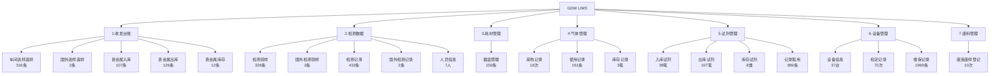

# 飞书多维表格 LIMS 功能树状图(字段级)

> **来源**: GDW实验室管理.xlsx(用户提供)
> **版本**: v1.0 | 2026-08-14
> **编制**: LIMS-Architect-01
> **结构**: 8 大模块 + 22 张子表 + 字段字典(从表头抽取)

---

## 1. 顶层模块树

```
GDW 实验室管理 LIMS
├── 1. 收发台账          (5 张子表)
│   ├── 1.1 【车间】送样返样
│   ├── 1.2 【国外】送样返样
│   ├── 1.3 【贵金属】入库
│   ├── 1.4 【贵金属】出库
│   └── 1.5 【贵金属】库存
├── 2. 检测数据          (5 张子表)
│   ├── 2.1 检测领样
│   ├── 2.2 【国外】检测领样
│   ├── 2.3 检测记录
│   ├── 2.4 【国外】检测记录
│   └── 2.5 人员信息
├── 3. 耗材管理          (1 张子表)
│   └── 3.1 器皿管理
├── 4. 气体管理          (3 张子表)
│   ├── 4.1 采购记录
│   ├── 4.2 使用记录
│   └── 4.3 库存记录
├── 5. 试剂管理          (4 张子表)
│   ├── 5.1 【入库】试剂
│   ├── 5.2 【出库】试剂
│   ├── 5.3 【库存】试剂
│   └── 5.4 【记录】取用
├── 6. 设备管理          (3 张子表)
│   ├── 6.1 设备信息
│   ├── 6.2 检定记录
│   └── 6.3 维保记录
└── 7. 废料管理          (1 张子表)
    └── 7.1 废液废样登记
```

**统计**:8 模块 / **22 张表** / 22 张表共记录约 3500+ 条

---

## 2. 字段字典(逐表)

### 2.1 【车间】送样返样(316 条)

| # | 字段 | 类型(推测) | 业务含义 |
|---|---|---|---|
| 1 | 送样日期 | date | 车间盲样送检时间 |
| 2 | 送样编号 | varchar(30) | 业务唯一编号(如 GSDW240813002) |
| 3 | 来样重量/g | decimal | 送检重量(黄金 g) |
| 4 | 送样人 | varchar | 车间送样负责人 |
| 5 | 送样收样人 | varchar | 实验室接收人 |
| 6 | 送样备注 | text | 留样/盲样标记 |
| 7 | 返样日期 | date | 检测完返还时间 |
| 8 | 1返样重量/g | decimal | 返还重量(可能损耗) |

### 2.2 【国外】送样返样(2 条)

字段同 2.1。

### 2.3 【贵金属】入库(107 条)

| # | 字段 | 类型 | 备注 |
|---|---|---|---|
| 1 | 日期 | date | |
| 2 | 样品编号 | varchar(30) | 与送样/库存关联 |
| 3 | 入库品类 | varchar | 标银9999/试样金/车间盲样 |
| 4 | 入库类型 | varchar | 普通入库 |
| 5 | 入库重量/g | decimal | 金/银重量 |
| 6 | 入库去向 | varchar | **保险柜**(关键) |
| 7 | 入库人 | varchar | |
| 8 | 复核人 | varchar | 双人复核(CNAS §7.4) |

### 2.4 【贵金属】出库(126 条)

同入库字段(对称),关键差异:
- **出库类型**:学习检测 / 生产检测 / 个人管理
- **出库去向**:天平室暂存 / 个人管理

### 2.5 【贵金属】库存(12 条)

| # | 字段 | 类型 |
|---|---|---|
| 1 | 日期 | date |
| 2 | 样品编号 | varchar(30) |
| 3 | 库存品类 | varchar |
| 4 | 库存重量/g | decimal |
| 5 | 复核人 | varchar |
| 6 | 备注 | text(含返车间/返还记录) |
| 7 | 月份检索 | varchar(7)(YYYY-MM 索引字段) |

### 2.6 检测领样(326 条)

| # | 字段 | 类型 | 备注 |
|---|---|---|---|
| 1 | 领样日期 | date | |
| 2 | 检测编号 | varchar | GSDW/LX/金猪 等 |
| 3 | 检测类型 | varchar | 生产检测/练习检测 |
| 4 | 领样品类 | varchar | 试样金-30101 等 |
| 5 | 检测方法 | varchar | ICP检测 / 火法检测 |
| 6 | 领取/g | decimal | |
| 7 | 剩余/g | decimal | **重要:留样余额** |
| 8 | 使用 | decimal | 实际消耗 |

### 2.7 检测记录(432 条)

| # | 字段 | 备注 |
|---|---|---|
| 1 | 检测时期 | datetime |
| 2 | 编号 | 检测编号 |
| 3 | 检测方法 | ICP / 火法 |
| 4 | 检测类型 | 生产/练习 |
| 5 | 参与检测人员 | **多人**(逗号分隔) |
| 6 | 检测设备 | ICP光谱仪/高温炉 |
| 7 | 检测地点 | (212)ICP室 / (207)火试金室 |
| 8 | 执行标准 | **关键: GB/T9288-2019 / QEGST/T01-2021 / GB/T38145-2019** |

### 2.8 人员信息(7 条)

| # | 字段 | 业务意义 |
|---|---|---|
| 1 | 序号 | |
| 2 | 姓名 | 周燕平/王茜/李珍玉/刘秀民/郁万刚/薛鸿 |
| 3 | 检测组 | 一组 / 二组 |
| 4 | 工号 | 内部编号(6 位数字) |
| 5 | 联系电话 | 11 位手机 |

### 2.9 器皿管理(150 条)

| # | 字段 | 备注 |
|---|---|---|
| 1 | 序号 | |
| 2 | 器材名称 | 容量瓶/烧杯/移液管 等 |
| 3 | 型号规格 | 200ml/100ml/50ml 等容量 |
| 4 | 入库日期 | date |
| 5 | 入库数量 | int |
| 6 | 在用 | int |
| 7 | 损耗 | int(**关键:CNAS §6.4 器具损耗记录**) |
| 8 | 库存 | int(入库-在用-损耗) |

### 2.10 采购记录(18 条)

| # | 字段 | 备注 |
|---|---|---|
| 1 | 采购日期 | date |
| 2 | 气体编号 | varchar(001/002) |
| 3 | 气体种类 | 高纯氩气 / 高纯乙炔 |
| 4 | 规格 | 40L 气瓶 |
| 5 | 生产厂家 | 兰州隆华特种气体 |
| 6 | 采购数量/瓶 | int |
| 7 | 采购人员 | |
| 8 | 采购单据 | 微信图片/PDF(附件) |

### 2.11 使用记录(161 条)

| # | 字段 |
|---|---|
| 1 | 使用日期 |
| 2 | 气体编号 |
| 3 | 气体种类 |
| 4 | 使用数量/瓶 |
| 5 | 负责人员 |
| 6 | 备注 |
| 7 | **父记录**(关键:溯源链) |

### 2.12 库存记录(3 条)

| # | 字段 |
|---|---|
| 1 | 库存日期 |
| 2 | 气体编号 |
| 3 | 气体种类 |
| 4 | 生产厂家 |
| 5 | 规格 |
| 6 | 库存数量/瓶(小数:5.5 瓶)|
| 7 | 负责人员 |
| 8 | 附件 |

### 2.13 试剂入库/出库/库存/取用(4 张表,字段相似)

字段集:
```
化学试剂名称 | 批号 | 规格 | 生产厂家 | 日期 | 数量 | 经手人 | 备注/附件/月份检索
```

---

## 3. 树状图(Mermaid)



---

## 4. 关键业务特征(从数据观察)

### 4.1 工作流闭环

```
送样 → 检测领样 → 检测记录 → 试剂取用 → 废液废样登记
```

### 4.2 关键人员

- 6 名检测员(周燕平/王茜/李珍玉/刘秀民/郁万刚/薛鸿),分一/二组
- 设备管理员/气体采购员/复核人/双人复核等角色

### 4.3 关键标准

- **GB/T 9288-2019**(火试金法)
- **GB/T 38145-2019**(贵金属 ICP 检测)
- **QEGST/T01-2021**(企业内部标准)

### 4.4 关键合规点

| 字段 | 体现 |
|---|---|
| 复核人(入库/出库) | 双人复核 |
| 父记录(气体使用) | 溯源链 |
| 月份检索(库存) | 分区检索优化 |
| 物品图片(库存附件) | 实物照片存档 |
| 检测地点(编号房号) | 物理定位 |

### 4.5 检测方法学

- 火法(GB/T 9288-2019)+ ICP 两种主方法
- **执行标准字段是关键**(可对标准版本自动校验过期)

---

## 5. 与现有 LIMS 架构功能覆盖对照

| 飞书表 | 行数 | 现有 LIMS 覆盖 | 备注 |
|---|---|---|---|
| 【车间】送样返样 | 316 | ✅ Sample + 状态机 | 需补 `SamplingRecord` 实体 |
| 【国外】送样返样 | 2 | 🟡 分流字段缺失 | 需 `Sample.hsCode/customsRef` |
| 【贵金属】入库 | 107 | 🟡 用 Reagent 兼代(概念错位)| 需独立 `PreciousMetalBar` |
| 【贵金属】出库 | 126 | � 同上 | 同上 |
| 【贵金属】库存 | 12 | 🟡 仅库存预警(无盘点) | 需盘点 + 批次余额汇总 API |
| 检测领样 | 326 | 🟡 Test.create + BATCHED | 需 `SamplingRecord` 实体 |
| 【国外】检测领样 | 2 | 🟡 | 需国际样品字段 |
| 检测记录 | 432 | ✅ Test + FireAssayDetail + ElementResult | 完整 |
| 【国外】检测记录 | 2 | 🟡 | 需国际字段 + GB/T 38145-2019 |
| 人员信息 | 7 | ✅ Personnel + Training + Competency | 完整(需分组/工号字段) |
| **器皿管理** | **150** | � **缺失** | 需 Container + ContainerUsage |
| 采购记录(气体) | 18 | 🔴 缺失 | 需 GasPurchase |
| 使用记录(气体) | 161 | 🔴 缺失 | 需 GasUsage(含父记录) |
| 库存记录(气体) | 3 | 🔴 缺失 | 需 Gas 库存表 |
| 【入库】试剂 | 38 | ✅ Reagent.addLot | 完整 |
| 【出库】试剂 | 107 | ✅ ReagentUsage | 完整 |
| 【库存】试剂 | 8 | ✅ Reagent.findAll + 库存预警 | 完整(缺附件:实物图) |
| 【记录】取用 | 369 | ✅ ReagentUsage | 完整 |
| 设备信息 | 37 | ✅ Equipment | 完整(需"重要等级""配件清单"字段) |
| 检定记录 | 70 | ✅ Calibration + isUsableForTesting | 完整(需检定类型/单位) |
| 维保记录 | 1969 | ✅ Maintenance + PeriodicCheck | 完整(需"维护内容"字段) |
| **废液废样登记** | **10** | 🔴 **缺失** | 需 WasteRecord + 处置闭环 |

## 6. 差距分级汇总

| 等级 | 飞书功能 | 现有覆盖 | 改进建议 |
|---|---|---|---|
| **🔴 P0** | 器皿管理(150) | 无 | Container + ContainerUsage |
| **🔴 P0** | 气体管理(3 张表) | 无 | Gas + GasPurchase + GasUsage |
| **🔴 P0** | 废液废样登记(10) | 无 | WasteRecord + 处置闭环 |
| � P1 | 检测领样单(326) | 部分 | SamplingRecord 实体 |
| 🟡 P1 | 国外样品(4) | 部分 | 海关/原产地字段 |
| 🟡 P1 | 贵金属独立化(2) | 部分 | PreciousMetalBar 独立模型 |
| 🟡 P1 | 库存附件图(8) | 部分 | FileAttachment + 图片管理 |
| 🟢 P2 | 设备重要等级 | 无 | 字段补全 |
| 🟢 P2 | 标准版本校验 | 无 | 自动校验 GB/T 标准过期 |

---

| 版本 | 日期 | 变更 | 编制 |
|---|---|---|---|
| v1.0 | 2026-08-14 | 首次发布(基于 GDW实验室管理.xlsx 22 张 sheet 字段抽取) | LIMS-Architect-01 |
