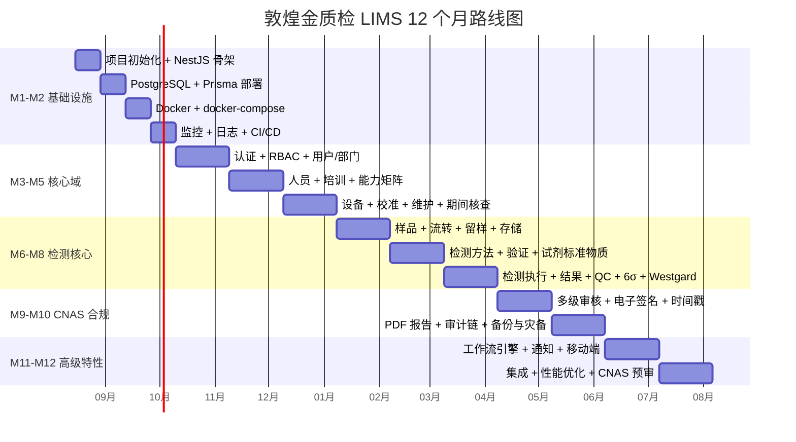
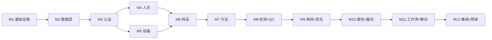

# 06 - 实施路线图（ROADMAP）

> **周期**: 12 个月
> **团队**: 8.5 人（详见 00-PROJECT-PLAN.md §6）
> **版本**: v1.0.0
> **日期**: 2026-08-03

---

## 1. 12 个月总览

## 2. 阶段里程碑

### 2.1 M1（2026-08）基础设施启动

**目标**: 项目骨架可运行

**任务清单**:
- [ ] 创建 monorepo（pnpm + Turborepo）
- [ ] 初始化 NestJS 后端（apps/backend）
- [ ] 初始化 React 前端（apps/frontend）
- [ ] 配置 TypeScript + ESLint + Prettier
- [ ] 创建 docker-compose.yml（本地开发）
- [ ] 创建 README.md + CONTRIBUTING.md
- [ ] 配置 GitHub Actions（CI）
- [ ] 部署 Prometheus + Grafana

**交付物**:
- ✅ apps/backend 可启动
- ✅ apps/frontend 可启动
- ✅ docker-compose up 一键启动所有依赖
- ✅ CI 跑通

**负责人**: 架构师 + 后端 + 前端 + DevOps

---

### 2.2 M2（2026-09）数据层与基础设施

**目标**: 数据库 + 部署就绪

**任务清单**:
- [ ] Prisma schema 定义（60+ 表）
- [ ] 数据库迁移（migrations）
- [ ] 种子数据（seed）
- [ ] Redis 集成
- [ ] MinIO 集成
- [ ] RabbitMQ 集成
- [ ] Helm charts 编写
- [ ] 阿里云 ACK 部署测试环境
- [ ] 备份脚本
- [ ] 监控告警

**交付物**:
- ✅ Prisma 迁移可重放
- ✅ 测试环境可访问
- ✅ 备份可恢复

**负责人**: 后端 + DevOps

---

### 2.3 M3（2026-10）认证 + 用户/部门

**目标**: 基础组织管理

**任务清单**:
- [ ] JWT 认证 + Refresh Token
- [ ] RBAC 权限系统
- [ ] 多因素认证（TOTP）
- [ ] 单点登录（OIDC）
- [ ] 用户 CRUD
- [ ] 部门 CRUD
- [ ] 审计日志中间件
- [ ] 用户管理 UI

**交付物**:
- ✅ 登录 / 登出 / 刷新 Token
- ✅ 用户/部门 CRUD
- ✅ 审计日志自动记录
- ✅ MFA 可启用

**负责人**: 后端 + 前端

---

### 2.4 M4（2026-11）人员 + 培训

**目标**: 人员能力管理

**任务清单**:
- [ ] 人员档案 CRUD
- [ ] 培训年度计划
- [ ] 培训记录
- [ ] 能力评估（笔试 + 实操）
- [ ] 监督记录
- [ ] 人员-项目授权矩阵
- [ ] 人员管理 UI

**交付物**:
- ✅ 完整人员生命周期管理
- ✅ 能力矩阵可视化
- ✅ 授权过期提醒

**负责人**: 后端 + 前端

---

### 2.5 M5（2026-12）设备全生命周期

**目标**: 设备 + 校准 + 维护

**任务清单**:
- [ ] 设备状态机
- [ ] 设备 CRUD
- [ ] 校准记录
- [ ] 维护记录
- [ ] 期间核查
- [ ] 设备-项目关联
- [ ] 校准到期提醒
- [ ] 设备管理 UI

**交付物**:
- ✅ 设备全生命周期
- ✅ 校准自动提醒
- ✅ 设备状态实时显示

**负责人**: 后端 + 前端

---

### 2.6 M6（2027-01）样品管理

**目标**: 样品从接收 → 留样 → 处置

**任务清单**:
- [ ] 样品状态机
- [ ] 样品 CRUD
- [ ] 唯一编号生成
- [ ] 样品流转
- [ ] 留样 + 存储
- [ ] 存储温湿度监控
- [ ] 处置流程
- [ ] 样品管理 UI

**交付物**:
- ✅ 完整样品生命周期
- ✅ 二维码扫描接收
- ✅ 留样到期提醒

**负责人**: 后端 + 前端 + 嵌入式（温湿度）

---

### 2.7 M7（2027-02）检测方法 + 标准物质

**目标**: 方法 + CRM 证书

**任务清单**:
- [ ] 检测方法 CRUD
- [ ] 方法验证（LOD/LOQ/不确定度）
- [ ] 标准物质 CRUD
- [ ] CRM 证书管理
- [ ] 期间核查
- [ ] 试剂 + 耗材 + 气体管理
- [ ] 方法管理 UI

**交付物**:
- ✅ 方法验证完整流程
- ✅ 标准物质证书存档
- ✅ 试剂库存预警

**负责人**: 后端 + 前端

---

### 2.8 M8（2027-03）检测执行 + QC

**目标**: 完整检测 + 6σ 质控

**任务清单**:
- [ ] 检测任务 CRUD
- [ ] 检测结果录入
- [ ] 多设备/多试剂关联
- [ ] 6 类质控样
- [ ] Westgard 规则引擎
- [ ] 6σ 趋势图
- [ ] QC 失控处理
- [ ] 检测管理 UI

**交付物**:
- ✅ 检测完整流程
- ✅ 实时 QC 监控
- ✅ 失控阻止发布

**负责人**: 后端 + 前端 + 领域专家

---

### 2.9 M9（2027-04）多级审核 + 电子签名

**目标**: CNAS 审核链

**任务清单**:
- [ ] 4 级审核状态机
- [ ] 审核 UI
- [ ] CA 证书集成
- [ ] TSA 时间戳
- [ ] 多级签名
- [ ] 阻止未签发发布
- [ ] 签名验证工具

**交付物**:
- ✅ 4 级审核链
- ✅ CA 签名 + 时间戳
- ✅ 报告合规发布

**负责人**: 后端 + 前端 + CNAS 顾问

---

### 2.10 M10（2027-05）PDF 报告 + 备份

**目标**: 报告 + 灾备

**任务清单**:
- [ ] Puppeteer PDF 渲染
- [ ] 报告模板
- [ ] 报告修订
- [ ] 完整备份策略
- [ ] 异地 OSS 同步
- [ ] 恢复演练
- [ ] 报告管理 UI

**交付物**:
- ✅ PDF 报告生成
- ✅ 完整备份恢复
- ✅ 月度演练报告

**负责人**: 后端 + 前端 + DevOps

---

### 2.11 M11（2027-06）工作流 + 通知 + 移动端

**目标**: 高级特性

**任务清单**:
- [ ] 工作流引擎（Flowable）
- [ ] 站内信
- [ ] 邮件通知
- [ ] 短信通知
- [ ] PWA 移动端
- [ ] 离线操作
- [ ] IndexedDB 同步

**交付物**:
- ✅ 完整工作流
- ✅ 多渠道通知
- ✅ 移动端可用

**负责人**: 后端 + 前端

---

### 2.12 M12（2027-07）集成 + 性能 + CNAS 预审

**目标**: 专家级 + 认证就绪

**任务清单**:
- [ ] OpenAPI 3.0 文档
- [ ] ERP 对接（按需）
- [ ] 省级监管上报
- [ ] 性能优化（压测）
- [ ] 安全审计（OWASP）
- [ ] CNAS 顾问预审
- [ ] 问题修复
- [ ] 上线准备

**交付物**:
- ✅ 完整文档
- ✅ 性能达标（P95 < 500ms）
- ✅ 通过预审
- ✅ 上线

**负责人**: 全员 + CNAS 顾问

## 3. 资源分配

| 角色 | M1-M2 | M3-M5 | M6-M8 | M9-M10 | M11-M12 |
|---|---|---|---|---|---|
| 架构师 | 1 | 1 | 0.5 | 1 | 1 |
| 后端 | 2 | 2 | 2 | 2 | 2 |
| 前端 | 2 | 2 | 2 | 1 | 1 |
| DevOps | 1 | 0.5 | 0.5 | 1 | 1 |
| 测试 | 0.5 | 1 | 1 | 1 | 1 |
| CNAS 顾问 | 0 | 0.5 | 0.5 | 1 | 1 |
| **合计** | **6.5** | **7** | **6.5** | **7** | **7** |

## 4. 关键节点

| 时间 | 节点 | 验收 |
|---|---|---|
| M2 末 | 可运行骨架 | 部署测试环境 |
| M5 末 | 核心域完成 | 用户/部门/人员/设备可用 |
| M8 末 | 检测核心完成 | 完整检测 + QC 流程 |
| M10 末 | CNAS 合规完成 | 多级签名 + 报告 |
| M12 末 | 系统上线 | CNAS 预审通过 |

## 5. 风险与依赖

### 5.1 风险登记册

| 风险 | 概率 | 影响 | 缓解 | 负责人 |
|---|---|---|---|---|
| CA 证书集成复杂 | 中 | 高 | 提前 POC + 选成熟 | 架构师 |
| 数据迁移失败 | 低 | 严重 | 双重备份 + 小批量 | 后端 |
| 性能不达标 | 中 | 中 | 早期压测 + 优化 | DevOps |
| 团队流失 | 中 | 中 | 文档 + 知识共享 | PM |
| 第三方依赖不可用 | 低 | 严重 | 备选供应商 | PM |

### 5.2 依赖关系

## 6. 进度跟踪

### 6.1 每周回顾

- **周一**：周计划
- **周三**：中期检查
- **周五**：周总结 + 风险更新

### 6.2 每月评审

- 进度对比计划
- 风险评估
- 资源调整
- 下月计划

### 6.3 文档更新

每完成 1 个里程碑：
- 更新本文档进度
- 添加阶段交付报告
- 更新 README.md

## 7. 附录

- [项目计划](00-PROJECT-PLAN.md)
- [架构设计](01-ARCHITECTURE.md)
- [数据库设计](02-DATABASE.md)
- [API 规范](03-API.md)
- [CNAS 合规](04-CNAS-COMPLIANCE.md)
- [部署架构](05-DEPLOYMENT.md)
