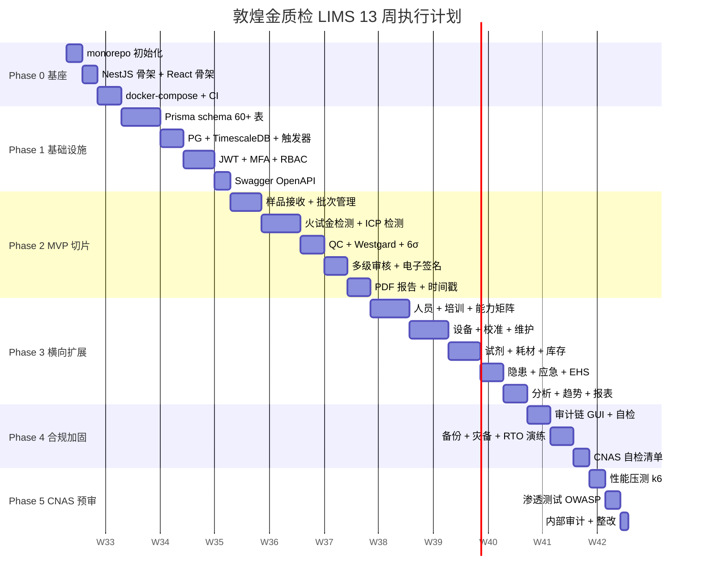

# 敦煌金质检 LIMS —— 13 周实施执行计划(EXECUTION PLAN)

> **版本**: v1.0.0
> **日期**: 2026-08-04
> **维护者**: 天枢(架构师)
> **周期**: 13 周(对比原 12 个月路线图)
> **范围**: 从零代码到 CNAS 现场审核就绪
> **业务约束**: 贵金属(黄金)检测 —— 火试金法 + ICP(详见 [ADR-0011](../adr/0011-precious-metal-business.md))

---

## 1. 总览

| 阶段 | 周期 | 主题 | 关键交付 | 验收 |
|---|---|---|---|---|
| **Phase 0** | 第 1 周 | 基座校准 | monorepo + NestJS + React + docker-compose | `pnpm dev` 全栈起;CI 绿 |
| **Phase 1** | 第 2-3 周 | 基础设施 | Prisma schema(60+ 表)+ 审计链触发器 + JWT/MFA + Swagger | 9 表迁移可重放;登录→审计闭环 |
| **Phase 2** | 第 4-6 周 | 垂直切片 MVP | 样品接收→火试金/ICP 检测→QC→多级审核→PDF 报告(电子签名) | 端到端 5 秒内;CNAS 8 大条款可演示 |
| **Phase 3** | 第 7-10 周 | 横向扩展 | 人员/培训/能力 + 设备/校准 + 试剂/库存 + 隐患 + 分析 | 13 模块 100% 上线;KPI:50→100 件/日 |
| **Phase 4** | 第 11-12 周 | 合规加固 | 审计链 GUI + 备份恢复演练 + 灾备 + CNAS 自检清单 | RTO ≤ 4h;SHA256 链断链 0 |
| **Phase 5** | 第 13 周 | CNAS 预审 | 性能压测 + 渗透测试 + 内部审计 + 整改报告 | API P95 < 500ms;1000 并发;CNAS 现场审核就绪 |

## 2. 时间表(甘特图)



## 3. 阶段详情

| 阶段 | 详细文档 |
|---|---|
| **Phase 0 基座校准** | [PHASE-0-baseline.md](./PHASE-0-baseline.md) |
| **Phase 1 基础设施** | [PHASE-1-infra.md](./PHASE-1-infra.md) |
| **Phase 2 垂直切片 MVP** | [PHASE-2-mvp-slice.md](./PHASE-2-mvp-slice.md) |
| **Phase 3 横向扩展** | [PHASE-3-horizontal.md](./PHASE-3-horizontal.md) |
| **Phase 4 合规加固** | [PHASE-4-compliance.md](./PHASE-4-compliance.md) |
| **Phase 5 CNAS 预审** | [PHASE-5-cnas-audit.md](./PHASE-5-cnas-audit.md) |

## 4. 关键里程碑

| 里程碑 | 周次 | 标志事件 | 业务价值 |
|---|---|---|---|
| **M1 基座就绪** | 第 1 周末 | 全栈可启动 + CI 绿 | 团队进入开发状态 |
| **M2 鉴权闭环** | 第 3 周末 | 登录 + 审计 + 追溯 | 合规基础 |
| **M3 MVP 切片** | 第 6 周末 | 样品→检测→报告端到端 | **可演示给客户/审核员** |
| **M4 功能完整** | 第 10 周末 | 13 模块全上线 | 完整业务能力 |
| **M5 合规就绪** | 第 12 周末 | 备份演练 + 自检通过 | CNAS 审核准备 |
| **M6 预审通过** | 第 13 周末 | 性能 + 安全 + 整改报告 | **CNAS 现场审核可申请** |

## 5. 业务垂直切片(Phase 2 详细)

### 5.1 火试金法端到端流程

```
客户送检(金锭/金粉/合金)
  ↓
样品接收(编号 + 称重 + 拍照 + 客户委托单)
  ↓
批次创建 FB-20260804-001(配 QC 样 + 3 平行样)
  ↓
任务分配(分配给检测员)
  ↓
熔融(1000-1100°C, 60-90 分钟)
  ↓
灰吹(灰皿氧化, 30-60 分钟)
  ↓
分金(硝酸 1:7, 30-60 分钟)
  ↓
退火(30 分钟)
  ↓
称重(分析天平 0.001mg)
  ↓
计算(差减法得 Au 纯度)
  ↓
QC 验证(空白 + 平行样 RSD + QC 样回收率)
  ↓
校核(数据合理性)
  ↓
审核(报告完整性)
  ↓
批准 + CA 电子签名 + 时间戳
  ↓
PDF 报告(含二维码 + SHA256)
  ↓
留样归档(MinIO + 异地备份)
```

### 5.2 ICP-OES / ICP-MS 端到端流程

```
客户送检
  ↓
样品接收
  ↓
批次创建 ICP-20260804-001
  ↓
微波消解(王水/HF, 2-4 小时)
  ↓
ICP 测量(自动进样, 30-60 分钟)
  ↓
多元素结果录入(Au/Ag/Pt/Pd/Cu/Fe...)
  ↓
QC 验证 + 6σ Z-score + Westgard 规则
  ↓
校核 → 审核 → 批准 → CA 签名
  ↓
PDF 报告
  ↓
留样归档
```

## 6. 团队与角色

| 角色 | 人数 | 主要职责 |
|---|---|---|
| 菩提老祖(产品负责人) | 1 | 业务决策、CNAS 对接、验收 |
| 天枢(架构师 + AI 全栈) | 1 | 架构、代码生成、Code Review、CI/CD |
| 后端工程师 | 1-2 | NestJS、Prisma、PG、测试 |
| 前端工程师 | 1 | React、Ant Design、UI |
| DevOps | 0.5(兼职) | Docker、K8s、监控 |
| CNAS 顾问 | 0.5(外部) | 合规审核 |

**合计**:5-6 人,对比原计划 8.5 人(调整后通过 AI 加速 + 业务收敛)

## 7. 风险与缓解

| 风险 | 概率 | 影响 | 缓解 |
|---|---|---|---|
| Phase 2 MVP 切片延期 | 中 | 高 | 严格 WIP 限制,只做"样品→检测→报告"3 个模块,其他延后 |
| CA 证书集成复杂 | 中 | 高 | Phase 4 提前 POC,选成熟服务(君子签/法大大) |
| 数据迁移丢失 | 低 | 严重 | 双重备份 + 小批量分阶段 |
| 性能问题 | 中 | 中 | Phase 5 压测,准备回滚 |
| 团队学习曲线 | 中 | 中 | 培训 + ADR + Code Review |
| 第三方依赖不可用 | 低 | 严重 | 备选供应商;关键依赖双备份 |
| CNAS 审核不通过 | 中 | 严重 | 提前预审 + 外部顾问 + 内部审核 |

## 8. 量化验收(全局)

| 维度 | 目标 | 验证工具 |
|---|---|---|
| **功能** | 13 模块 100% 上线;200 业务场景通过 | Jest + Supertest + Playwright |
| **性能** | API P95 < 500ms;1000 并发;100 万记录 ≤ 1s | k6 + Lighthouse |
| **前端** | Lighthouse ≥ 95;LCP < 2.5s | Lighthouse CI |
| **可用性** | SLO 99.9% → 99.99% | Prometheus + AlertManager |
| **合规** | ALCOA+ 9 原则 100%;SHA256 链 0 断链 | audit-verify.ts |
| **代码质量** | 单元 ≥ 70%(L4 ≥ 85%);E2E 关键路径 100% | Vitest + Playwright |
| **可观测** | 指标 100%;告警 < 5min;链路 100% | OTel + Grafana |

## 9. 关键 ADR 索引

| ADR | 决策 |
|---|---|
| [ADR-0001](../adr/0001-monorepo-turborepo.md) | Monorepo + pnpm + Turborepo |
| [ADR-0002](../adr/0002-nestjs-prisma-pg.md) | NestJS + Prisma + PG16 + TimescaleDB |
| [ADR-0003](../adr/0003-audit-chain-pg-trigger.md) | 审计链 PG 触发器 |
| [ADR-0004](../adr/0004-ca-third-party.md) | 第三方 CA 服务 |
| [ADR-0005](../adr/0005-xstate-redundant-db.md) | XState + DB 字段冗余 |
| [ADR-0006](../adr/0006-pdf-puppeteer-minio.md) | Puppeteer + MinIO + 时间戳 |
| [ADR-0007](../adr/0007-mvp-slice-not-12months.md) | MVP 切片优先 |
| [ADR-0008](../adr/0008-local-k8s-kind-k3d.md) | kind/k3d 本地 K8s |
| [ADR-0009](../adr/0009-jwt-refresh-totp-self-hosted.md) | JWT + TOTP 自建认证 |
| [ADR-0010](../adr/0010-pwa-indexeddb-lww.md) | PWA 离线 + IndexedDB + LWW |
| [ADR-0011](../adr/0011-precious-metal-business.md) | 贵金属检测业务约束 |

## 10. 附录

- [架构设计](../01-ARCHITECTURE.md)
- [数据库设计](../02-DATABASE.md)
- [API 规范](../03-API.md)
- [CNAS 合规](../04-CNAS-COMPLIANCE.md)
- [部署架构](../05-DEPLOYMENT.md)
- [重写路线图](../06-ROADMAP.md)
- [原 12 个月路线图归档](../archive/06-ROADMAP-12months-original.md)